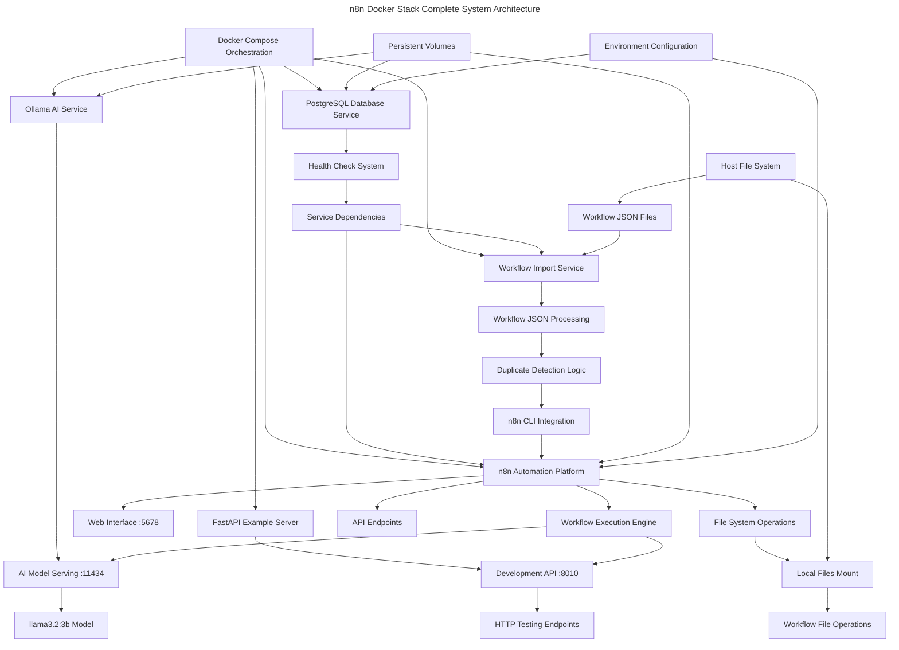
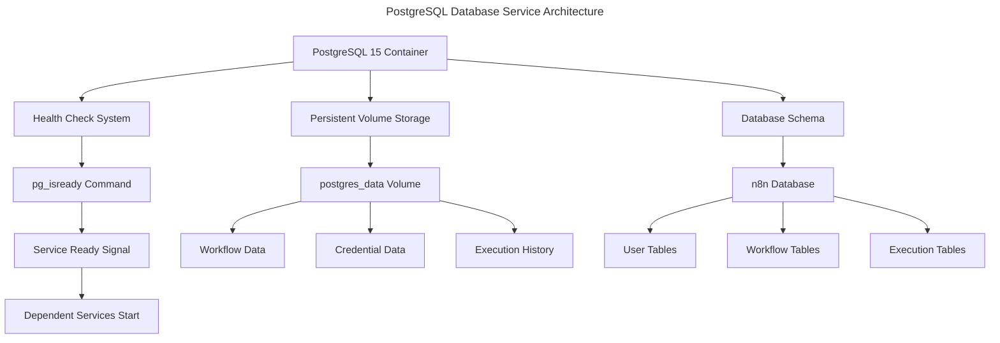
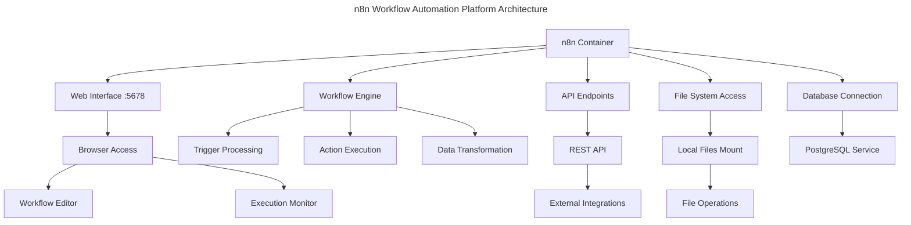
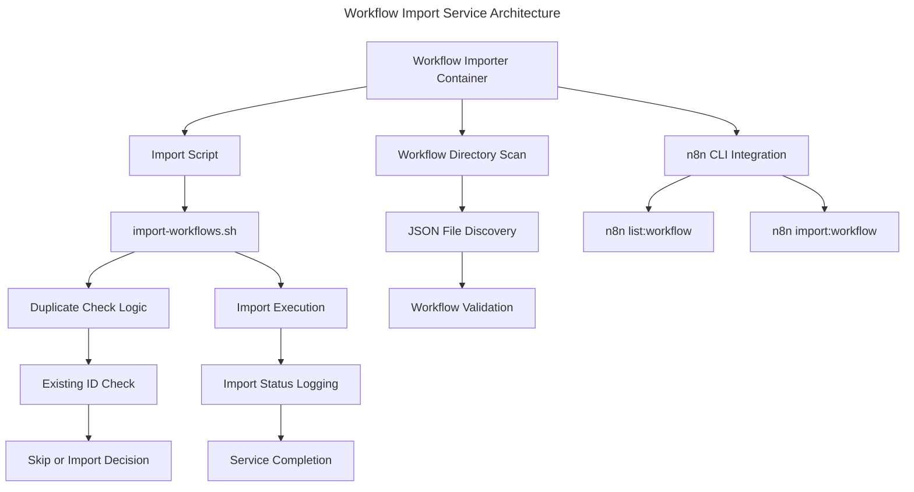
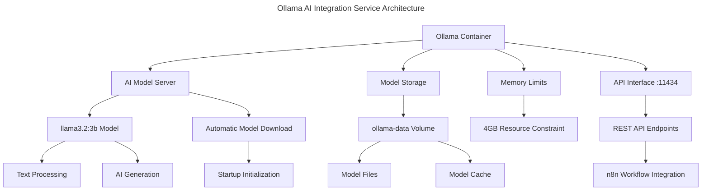
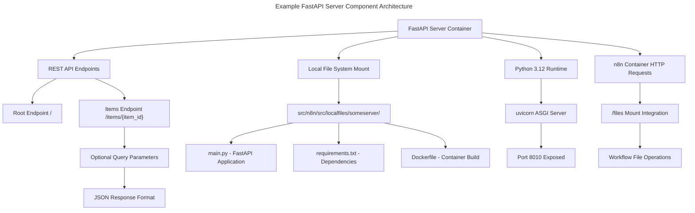

# n8n Docker Stack Architecture

This document contains the architectural design of the n8n Docker Stack solution with the focus on the high level components and how they interact. Use of the names and their appropriate technologies are required.

## Project Structure Overview

**Core project directories**
- src/n8n/src/docker-compose.yml - Multi-service orchestration configuration with PostgreSQL, n8n, Ollama, and workflow-importer services
- src/n8n/src/Dockerfile - Custom n8n image extending official n8n image with jq and zip utilities
- src/n8n/src/scripts/import-workflows.sh - Intelligent workflow import script with duplicate detection
- src/n8n/src/workflows/ - Pre-configured workflow JSON definitions automatically imported on startup
- src/n8n/src/localfiles/ - File operations directory mounted to n8n container with FastAPI example server
- docs/designs/ - Architecture and use case documentation following AI template standards
- docs/1.COLLABORATION.md - Comprehensive collaboration guide with setup and debugging instructions

This project provides a complete Docker-based n8n workflow automation platform with PostgreSQL database, automatic workflow import, Ollama AI integration, and comprehensive documentation following established AI template standards.

## System Overview Architecture

**Complete System Integration Diagram**

## High-level Component definitions & use

Describes the definitions and use of each component in the design, its technology and the scope of the use of any services.

**System components**

**PostgreSQL Database Service**

A PostgreSQL 15 database service that provides persistent storage for n8n workflows, credentials, execution data, and user configurations. This component serves as the central data repository for the entire n8n automation platform.

**Core Functionality: PostgreSQL Database Service**

- **Data Persistence**: Stores n8n workflows, credentials, execution history, and user settings in a relational database format
- **Health Monitoring**: Implements health checks to ensure database readiness before dependent services start
- **Volume Management**: Uses Docker volumes for persistent data storage across container restarts and updates
- **Connection Management**: Provides secure database connections with configurable credentials and connection parameters

**Architecture Diagram of component: PostgreSQL Database Service**

**n8n Workflow Automation Platform**

The main n8n service that provides the workflow automation platform with web interface, API endpoints, and workflow execution engine. This component handles all user interactions and workflow processing.

**Core Functionality: n8n Workflow Automation Platform**

- **Web Interface**: Provides browser-based workflow editor and management interface accessible on port 5678
- **Workflow Execution**: Processes and executes automated workflows with support for triggers, actions, and data transformations
- **API Integration**: Offers REST API endpoints for external integrations and programmatic workflow management
- **File Operations**: Supports file processing through mounted volume access to local file system
- **Authentication**: Implements basic authentication with configurable user credentials

**Architecture Diagram of component: n8n Workflow Automation Platform**

**Workflow Import Service**

A specialized one-time service that automatically imports JSON workflow definitions from the workflows directory into the n8n instance during startup. This component ensures pre-configured workflows are available immediately.

**Core Functionality: Workflow Import Service**

- **Automatic Import**: Scans workflows directory and imports all JSON workflow files into n8n instance
- **Duplicate Detection**: Checks existing workflows to prevent duplicate imports and conflicts
- **Startup Coordination**: Runs after database is ready but before main n8n service starts
- **Import Validation**: Validates JSON workflow format and handles import errors gracefully

**Architecture Diagram of component: Workflow Import Service**

**Ollama AI Integration Service**

An AI model serving platform that provides local LLM capabilities for AI-powered workflow automation. This component enables n8n workflows to leverage artificial intelligence for text processing, analysis, and generation tasks.

**Core Functionality: Ollama AI Integration Service**

- **AI Model Serving**: Hosts and serves the llama3.2:3b language model for workflow AI operations
- **API Interface**: Provides REST API endpoints on port 11434 for AI model interactions
- **Memory Management**: Implements 4GB memory limits for efficient AI model operations
- **Model Management**: Automatically downloads and initializes AI models on container startup

**Architecture Diagram of component: Ollama AI Integration Service**

**Example FastAPI Server Component**

A sample FastAPI server included in the localfiles/someserver directory that demonstrates how external services can be integrated with n8n workflows. This component serves as a reference implementation for custom API endpoints that can be called from n8n workflows.

**Core Functionality: Example FastAPI Server Component**

- **API Endpoints**: Provides sample REST API endpoints (root "/" and "/items/{id}") for testing n8n HTTP request nodes
- **File System Integration**: Located in localfiles/someserver directory for easy access from n8n container via /files mount
- **Development Reference**: Serves as a template for building custom services that integrate with n8n workflows
- **Containerized Deployment**: Includes Dockerfile with Python 3.12-slim base image for independent deployment
- **FastAPI Framework**: Uses FastAPI with uvicorn server running on port 8010 for high-performance API operations

**Architecture Diagram of component: Example FastAPI Server Component**

