# n8n Docker Stack Architecture

This document contains the architectural design of the n8n Docker Stack solution with the focus on the high level components and how they interact. Use of the names and their appropriate technologies are required.

## Project Structure Overview

**Core project directories**
- src/n8n/src/docker-compose.yml - Multi-service orchestration configuration with PostgreSQL, n8n, Ollama, and workflow-importer services
- src/n8n/src/Dockerfile - Custom n8n image extending official n8n image with jq and zip utilities
- src/n8n/src/scripts/import-workflows.sh - Intelligent workflow import script with duplicate detection
- src/n8n/src/workflows/ - Pre-configured workflow JSON definitions automatically imported on startup
- src/n8n/src/localfiles/ - File operations directory mounted to n8n container with FastAPI example server
- src/security/ - **NEW** Security hardening stack with nginx reverse proxy, SSL/TLS, secrets management, and intrusion prevention
- src/security/docker-compose.security.yml - **NEW** Security-enhanced Docker orchestration with nginx, fail2ban, and network isolation
- src/security/nginx/ - **NEW** Nginx reverse proxy configuration with SSL termination and security headers
- src/security/secrets/ - **NEW** Docker secrets management for secure credential storage
- src/security/fail2ban/ - **NEW** Intrusion prevention system configuration
- src/backup-restore/ - **NEW** Automated backup and disaster recovery system
- src/backup-restore/automated-backups/ - **NEW** Automated backup scripts with integrity verification
- src/backup-restore/restore-scripts/ - **NEW** Comprehensive restore procedures and scripts
- src/monitoring/ - Comprehensive monitoring stack with Prometheus, Grafana, and AlertManager
- src/monitoring/docker-compose.monitoring.yml - Multi-service monitoring orchestration (Prometheus, Grafana, AlertManager, exporters)
- src/monitoring/prometheus/ - Prometheus configuration with alert rules and service discovery
- src/monitoring/grafana/ - Grafana dashboards and provisioning configuration for visualization
- src/monitoring/alertmanager/ - AlertManager configuration for intelligent alert routing and notifications
- docs/designs/ - Architecture and use case documentation following AI template standards
- docs/1.COLLABORATION.md - Comprehensive collaboration guide with setup and debugging instructions

This project provides a complete Docker-based n8n workflow automation platform with PostgreSQL database, automatic workflow import, Ollama AI integration, **comprehensive security hardening with HTTPS/TLS termination, secrets management, network isolation, intrusion prevention, and automated backup systems**, comprehensive monitoring and observability stack with Prometheus/Grafana/AlertManager, and extensive documentation following established AI template standards.

## System Overview Architecture

**Complete System Integration Diagram**

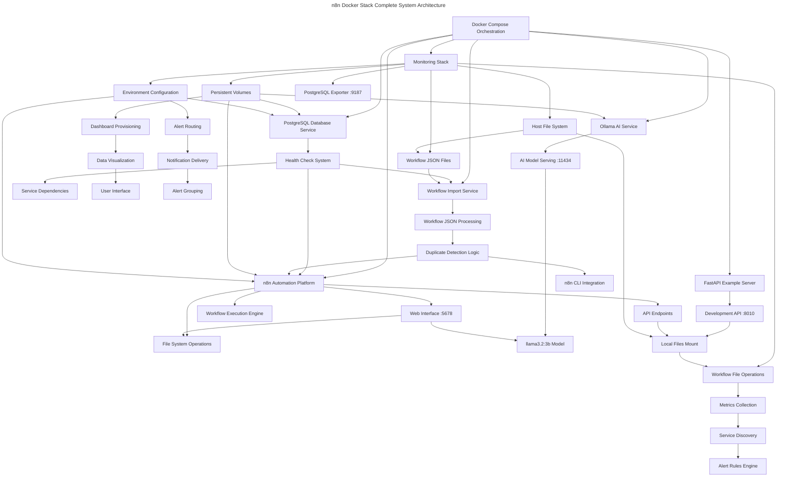

## High-level Component definitions & use

Describes the definitions and use of each component in the design, its technology and the scope of the use of any services.

**System components**

**PostgreSQL Database Service**

A PostgreSQL 15 database service that provides persistent storage for n8n workflows, credentials, execution data, and user configurations. This component serves as the central data repository for the entire n8n automation platform.

**Core Functionality: PostgreSQL Database Service**

- **Data Persistence**: Stores n8n workflows, credentials, execution history, and user settings in a relational database format
- **Health Monitoring**: Implements health checks to ensure database readiness before dependent services start
- **Volume Management**: Uses Docker volumes for persistent data storage across container restarts and updates
- **Connection Management**: Provides secure database connections with configurable credentials and connection parameters

**Architecture Diagram of component: PostgreSQL Database Service**

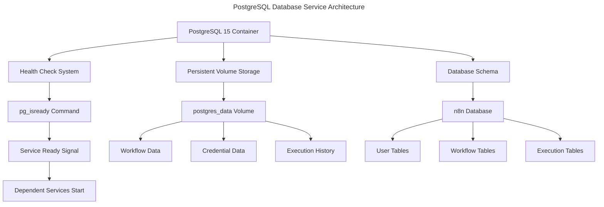

**n8n Workflow Automation Platform**

The main n8n service that provides the workflow automation platform with web interface, API endpoints, and workflow execution engine. This component handles all user interactions and workflow processing.

**Core Functionality: n8n Workflow Automation Platform**

- **Web Interface**: Provides browser-based workflow editor and management interface accessible on port 5678
- **Workflow Execution**: Processes and executes automated workflows with support for triggers, actions, and data transformations
- **API Integration**: Offers REST API endpoints for external integrations and programmatic workflow management
- **File Operations**: Supports file processing through mounted volume access to local file system
- **Authentication**: Implements basic authentication with configurable user credentials

**Architecture Diagram of component: n8n Workflow Automation Platform**

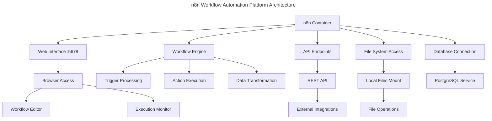

**Workflow Import Service**

A specialized one-time service that automatically imports JSON workflow definitions from the workflows directory into the n8n instance during startup. This component ensures pre-configured workflows are available immediately.

**Core Functionality: Workflow Import Service**

- **Automatic Import**: Scans workflows directory and imports all JSON workflow files into n8n instance
- **Duplicate Detection**: Checks existing workflows to prevent duplicate imports and conflicts
- **Startup Coordination**: Runs after database is ready but before main n8n service starts
- **Import Validation**: Validates JSON workflow format and handles import errors gracefully

**Architecture Diagram of component: Workflow Import Service**

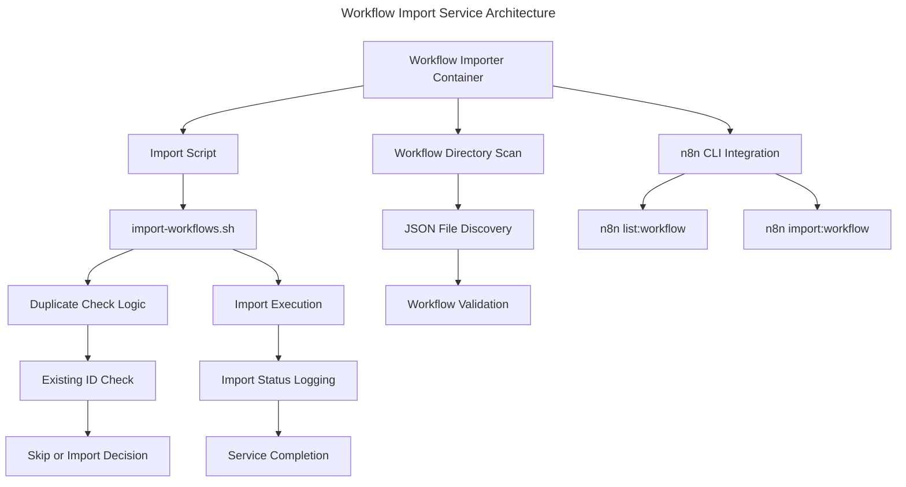

**Ollama AI Integration Service**

An AI model serving platform that provides local LLM capabilities for AI-powered workflow automation. This component enables n8n workflows to leverage artificial intelligence for text processing, analysis, and generation tasks.

**Core Functionality: Ollama AI Integration Service**

- **AI Model Serving**: Hosts and serves the llama3.2:3b language model for workflow AI operations
- **API Interface**: Provides REST API endpoints on port 11434 for AI model interactions
- **Memory Management**: Implements 4GB memory limits for efficient AI model operations
- **Model Management**: Automatically downloads and initializes AI models on container startup

**Architecture Diagram of component: Ollama AI Integration Service**

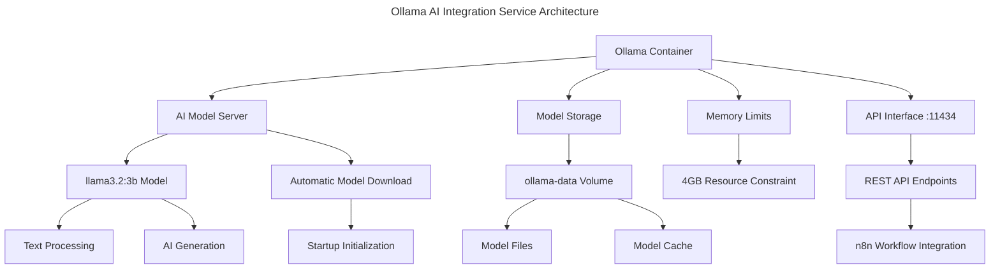

**Example FastAPI Server Component**

A sample FastAPI server included in the localfiles/someserver directory that demonstrates how external services can be integrated with n8n workflows. This component serves as a reference implementation for custom API endpoints that can be called from n8n workflows.

**Core Functionality: Example FastAPI Server Component**

- **API Endpoints**: Provides sample REST API endpoints (root "/" and "/items/{id}") for testing n8n HTTP request nodes
- **File System Integration**: Located in localfiles/someserver directory for easy access from n8n container via /files mount
- **Development Reference**: Serves as a template for building custom services that integrate with n8n workflows
- **Containerized Deployment**: Includes Dockerfile with Python 3.12-slim base image for independent deployment
- **FastAPI Framework**: Uses FastAPI with uvicorn server running on port 8010 for high-performance API operations

**Architecture Diagram of component: Example FastAPI Server Component**

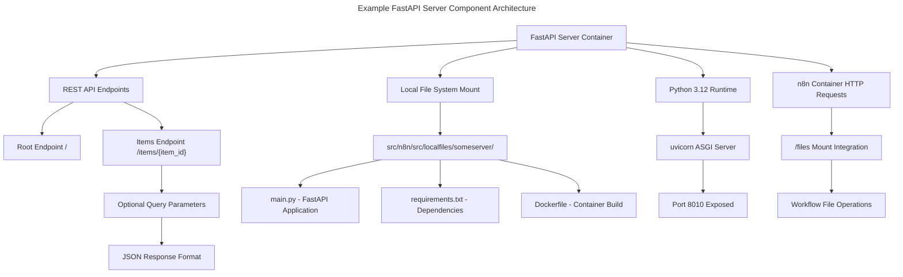

**Monitoring Stack Architecture**

The comprehensive monitoring and observability platform that provides complete visibility into the n8n Docker stack performance, health, and resource usage. This component ensures operational excellence through metrics collection, visualization, and intelligent alerting.

**Core Functionality: Monitoring Stack Architecture**

- **Metrics Collection**: Prometheus scrapes metrics from all services including n8n, PostgreSQL, system resources, and containers with 30-day retention
- **Visualization Platform**: Grafana provides pre-configured dashboards for n8n overview, system monitoring, and database performance with automatic provisioning
- **Intelligent Alerting**: AlertManager routes alerts based on configurable rules for service health, resource thresholds, and database performance
- **Multi-Service Monitoring**: Comprehensive observability across n8n application, PostgreSQL database, Ollama AI service, system resources, and container metrics
- **Integration Ready**: Webhook support for sending alerts back to n8n workflows and external notification systems

**Architecture Diagram of component: Monitoring Stack Architecture**

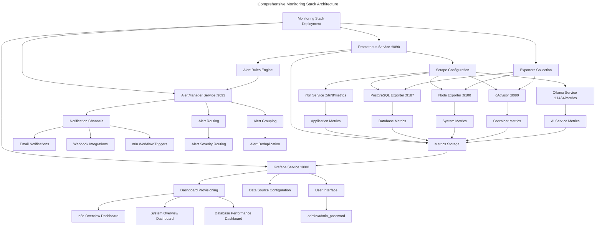

**Prometheus Metrics Collection Service**

A time-series database and monitoring system that collects, stores, and processes metrics from all components of the n8n Docker stack. This component serves as the central metrics repository with intelligent scraping and alert rule evaluation.

**Core Functionality: Prometheus Metrics Collection Service**

- **Service Discovery**: Automatically discovers and monitors all configured services including n8n, PostgreSQL, system resources, and containers
- **Metrics Storage**: Stores time-series data with 30-day retention period and efficient compression for optimal performance
- **Alert Processing**: Evaluates alert rules for service health, resource usage thresholds, and database performance metrics
- **API Interface**: Provides REST API endpoints for metrics queries, configuration management, and status monitoring

**Architecture Diagram of component: Prometheus Metrics Collection Service**

```mermaid
---
title: Prometheus Metrics Collection Architecture
---
flowchart TD
    A["Prometheus Container :9090"] --> B["Configuration Management"]
    A --> C["Metrics Storage Engine"]
    A --> D["Scrape Target Manager"]
    A --> E["Alert Rules Processor"]
    
    B --> F["prometheus.yml Configuration"]
    B --> G["alert_rules.yml Rules"]
    
    D --> H["n8n Application Scraping"]
    D --> I["PostgreSQL Exporter Scraping"]
    D --> J["Node Exporter Scraping"]
    D --> K["cAdvisor Scraping"]
    D --> L["Ollama Service Scraping"]
    
    H --> M["Workflow Execution Metrics"]
    H --> N["API Response Times"]
    H --> O["Service Health Status"]
    
    I --> P["Database Connection Metrics"]
    I --> Q["Query Performance Data"]
    I --> R["Database Size Statistics"]
    
    J --> S["CPU Usage Metrics"]
    J --> T["Memory Utilization Data"]
    J --> U["Disk Space Statistics"]
    J --> V["Network Traffic Metrics"]
    
    K --> W["Container Resource Usage"]
    K --> X["Container Health Status"]
    K --> Y["Container Restart Counts"]
    
    L --> Z["AI Model Response Times"]
    L --> AA["AI Service Availability"]
    
    C --> BB["Time Series Database"]
    BB --> CC["30-Day Retention"]
    BB --> DD["Data Compression"]
    
    E --> EE["Service Health Alerts"]
    E --> FF["Resource Threshold Alerts"]
    E --> GG["Database Performance Alerts"]
    
    EE --> HH["AlertManager Integration"]
    FF --> HH
    GG --> HH
```

**Grafana Visualization Platform**

A comprehensive dashboard and visualization platform that transforms Prometheus metrics into actionable insights through pre-configured dashboards, real-time monitoring, and user-friendly interfaces for the n8n Docker stack.

**Core Functionality: Grafana Visualization Platform**

- **Dashboard Provisioning**: Automatically provisions pre-configured dashboards for n8n overview, system monitoring, and database performance
- **Data Source Integration**: Seamlessly connects to Prometheus for real-time metrics visualization and historical trend analysis
- **User Interface**: Provides web-based interface (admin/admin_password) for dashboard viewing, customization, and alert management
- **Alert Visualization**: Displays alert status, historical alert data, and alert rule configurations for operational awareness

**Architecture Diagram of component: Grafana Visualization Platform**

```mermaid
---
title: Grafana Visualization Platform Architecture
---
flowchart TD
    A["Grafana Container :3000"] --> B["Authentication System"]
    A --> C["Dashboard Manager"]
    A --> D["Data Source Connector"]
    A --> E["Provisioning Engine"]
    
    B --> F["Local Admin Authentication"]
    F --> G["admin/admin_password"]
    
    C --> H["Pre-configured Dashboards"]
    H --> I["n8n Stack Overview"]
    H --> J["System Resources Overview"]
    H --> K["Database Performance"]
    
    D --> L["Prometheus Data Source"]
    L --> M["Metrics Query Engine"]
    M --> N["Real-time Data Updates"]
    
    E --> O["Automatic Dashboard Provisioning"]
    E --> P["Data Source Provisioning"]
    
    O --> Q["dashboards.yml Configuration"]
    P --> R["prometheus.yml Data Source"]
    
    I --> S["Workflow Execution Panels"]
    I --> T["Service Health Panels"]
    I --> U["API Performance Panels"]
    
    J --> V["CPU Utilization Graphs"]
    J --> W["Memory Usage Graphs"]
    J --> X["Disk Space Monitoring"]
    J --> Y["Network Traffic Graphs"]
    
    K --> Z["Connection Pool Status"]
    K --> AA["Query Performance Metrics"]
    K --> BB["Database Size Trends"]
    
    A --> CC["Persistent Volume Storage"]
    CC --> DD["grafana_data Volume"]
    DD --> EE["Dashboard Configurations"]
    DD --> FF["User Settings"]
    DD --> GG["Alert Configurations"]
```

**AlertManager Notification System**

An intelligent alert routing and notification management system that processes alerts from Prometheus and delivers notifications through multiple channels including email, webhooks, and n8n workflow integrations.

**Core Functionality: AlertManager Notification System**

- **Alert Routing**: Routes alerts based on severity, service type, and custom labels to appropriate notification channels
- **Notification Delivery**: Supports multiple notification channels including email, webhooks, and direct n8n workflow triggers
- **Alert Grouping**: Groups related alerts to prevent notification spam and provides consolidated alert summaries
- **Integration Ready**: Webhook endpoints configured for sending alerts back to n8n workflows for automated response procedures

**Architecture Diagram of component: AlertManager Notification System**

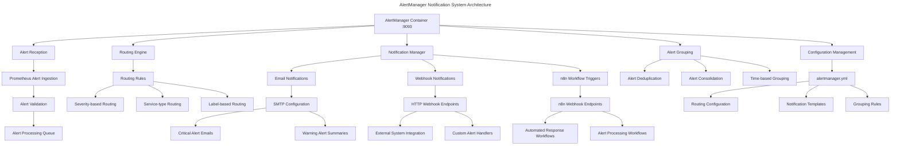

**Exporter Services Collection**

A comprehensive collection of specialized metric exporters that gather detailed performance and health data from system resources, containers, and database services for complete observability of the n8n Docker stack infrastructure.

**Core Functionality: Exporter Services Collection**

- **System Monitoring**: Node Exporter collects comprehensive system metrics including CPU, memory, disk, and network statistics
- **Container Monitoring**: cAdvisor provides detailed container resource usage, health status, and performance metrics
- **Database Monitoring**: PostgreSQL Exporter gathers database-specific metrics including connections, queries, and performance data
- **Service Integration**: All exporters expose metrics in Prometheus format for seamless integration with the monitoring stack

**Architecture Diagram of component: Exporter Services Collection**

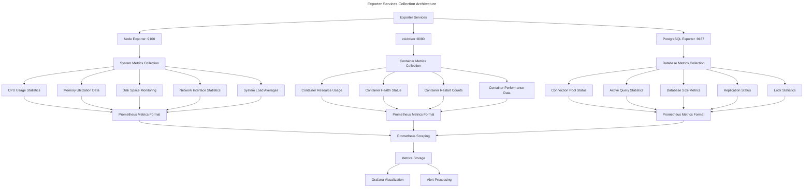

**Testing and Validation Infrastructure**

A comprehensive testing and validation system that ensures monitoring stack functionality, service health, and integration integrity through automated testing scripts and validation procedures.

**Core Functionality: Testing and Validation Infrastructure**

- **Automated Testing**: Comprehensive test suite for monitoring stack components with health validation and integration testing
- **Service Validation**: Individual service health checks for Prometheus, Grafana, AlertManager, and all exporters with endpoint verification
- **Integration Verification**: Complete stack integration testing with network connectivity, metrics flow, and dashboard functionality validation
- **Configuration Validation**: Docker Compose configuration validation, service dependency verification, and deployment readiness testing

**Architecture Diagram of component: Testing and Validation Infrastructure**

```mermaid
---
title: Testing and Validation Infrastructure Architecture
---
flowchart TD
    A["Testing Infrastructure"] --> B["test-monitoring.sh"]
    A --> C["verify-integration.sh"]
    A --> D["start-monitoring.sh"]
    
    B --> E["Container Status Tests"]
    B --> F["Service Health Tests"]
    B --> G["Metrics Collection Tests"]
    B --> H["Dashboard Tests"]
    B --> I["Alert System Tests"]
    
    E --> J["Docker Container Validation"]
    J --> K["n8n-prometheus"]
    J --> L["n8n-grafana"]
    J --> M["n8n-alertmanager"]
    J --> N["n8n-node-exporter"]
    J --> O["n8n-cadvisor"]
    J --> P["n8n-postgres-exporter"]
    
    F --> Q["Health Endpoint Validation"]
    Q --> R["Prometheus /-/healthy"]
    Q --> S["Grafana /api/health"]
    Q --> T["AlertManager /-/healthy"]
    Q --> U["Exporter /metrics"]
    
    G --> V["Metrics Flow Validation"]
    V --> W["Prometheus Targets Check"]
    V --> X["Node Exporter Metrics"]
    V --> Y["cAdvisor Metrics"]
    V --> Z["PostgreSQL Exporter Metrics"]
    
    H --> AA["Dashboard Functionality"]
    AA --> BB["Grafana Data Sources"]
    AA --> CC["Dashboard Rendering"]
    AA --> DD["Query Execution"]
    
    I --> EE["Alert Rules Validation"]
    EE --> FF["AlertManager Configuration"]
    EE --> GG["Notification Channels"]
    
    C --> HH["Plan Implementation Verification"]
    C --> II["Documentation Updates Check"]
    C --> JJ["Configuration Completeness"]
    C --> KK["Functional Tests Execution"]
    
    D --> LL["Automated Startup"]
    D --> MM["Health Check Validation"]
    D --> NN["Service Readiness"]
    D --> OO["Access Information Display"]
```

# Security Stack Architecture

The comprehensive security hardening framework that transforms the development n8n Docker Stack into a production-ready deployment with enterprise-grade security measures, network isolation, and credential protection.

**Core Functionality: Security Stack Architecture**

- **SSL/TLS Termination**: Nginx reverse proxy with automated SSL certificate generation for secure HTTPS communication on port 443
- **Network Isolation**: Multi-tier network architecture with frontend, backend, and database networks providing defense in depth
- **Secrets Management**: Docker secrets integration for secure credential storage and distribution across all services
- **Intrusion Prevention**: Fail2ban integration with custom filters for nginx authentication failures and rate limit violations
- **Security Headers**: Comprehensive HTTP security headers including HSTS, CSP, and XSS protection through nginx configuration
- **Rate Limiting**: Configurable rate limiting to prevent abuse and DDoS attacks with fail2ban integration

**Architecture Diagram of component: Security Stack Architecture**

```mermaid
---
title: Comprehensive Security Stack Architecture
---
flowchart TD
    A["Security Stack Deployment"] --> B["Frontend Network"]
    A --> C["Backend Network"]
    A --> D["Database Network"]
    A --> E["Docker Secrets Manager"]
    A --> F["Nginx Reverse Proxy"]
    A --> G["Fail2ban Intrusion Prevention"]
    
    B --> H["External HTTPS Access :443"]
    B --> I["External HTTP Access :80"]
    B --> J["Public Internet Traffic"]
    
    C --> K["n8n Application Service"]
    C --> L["Internal Service Communication"]
    C --> M["API Gateway Layer"]
    
    D --> N["PostgreSQL Database"]
    D --> O["Database Storage"]
    D --> P["Most Restricted Access"]
    
    E --> Q["PostgreSQL Credentials"]
    E --> R["n8n Authentication"]
    E --> S["Encryption Keys"]
    E --> T["Grafana Admin Credentials"]
    
    F --> U["SSL Certificate Management"]
    F --> V["Security Headers"]
    F --> W["Rate Limiting"]
    F --> X["WebSocket Support"]
    
    G --> Y["Authentication Failure Detection"]
    G --> Z["Rate Limit Violation Detection"]
    G --> AA["IP Blocking and Filtering"]
    G --> BB["Automated Response"]
    
    H --> F
    I --> F
    F --> K
    
    Q --> N
    R --> K
    S --> K
    T --> CC["Grafana Service"]
    
    U --> DD["Self-signed Development"]
    U --> EE["CA-signed Production"]
    
    V --> FF["HSTS Headers"]
    V --> GG["CSP Headers"]
    V --> HH["XSS Protection"]
    
    Y --> II["nginx-auth Filter"]
    Z --> JJ["nginx-limit-req Filter"]
    
    AA --> KK["iptables Rules"]
    BB --> LL["Service Restart"]
    
    A --> MM["Security Monitoring"]
    MM --> NN["Log Analysis"]
    MM --> OO["Alert Generation"]
    MM --> PP["Security Metrics"]
```

**Nginx Reverse Proxy Service**

A production-grade reverse proxy that provides SSL termination, security headers, and load balancing for the n8n application with WebSocket support and comprehensive security configurations.

**Core Functionality: Nginx Reverse Proxy Service**

- **SSL/TLS Termination**: Handles all HTTPS encryption/decryption with configurable SSL certificates for secure communication
- **Security Headers**: Implements comprehensive HTTP security headers including HSTS, Content Security Policy, and XSS protection
- **Rate Limiting**: Configurable request rate limiting to prevent abuse and ensure service availability under load
- **WebSocket Support**: Native WebSocket proxying for real-time n8n workflow execution and monitoring
- **Load Balancing**: Backend service distribution and health checking for high availability deployments

**Architecture Diagram of component: Nginx Reverse Proxy Service**

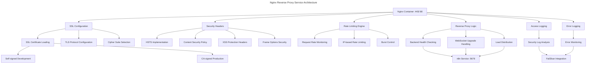

**Fail2ban Intrusion Prevention System**

An advanced intrusion prevention system that monitors nginx logs and automatically blocks malicious IP addresses based on configurable attack patterns and thresholds.

**Core Functionality: Fail2ban Intrusion Prevention System**

- **Log Monitoring**: Real-time analysis of nginx access and error logs for attack pattern detection
- **Custom Filters**: Specialized filters for detecting n8n authentication failures and rate limit violations
- **Automated IP Blocking**: Dynamic iptables rules for blocking malicious IP addresses with configurable ban times
- **Attack Response**: Intelligent response to various attack types including brute force, DoS, and unauthorized access attempts

**Architecture Diagram of component: Fail2ban Intrusion Prevention System**

```mermaid
---
title: Fail2ban Intrusion Prevention Architecture
---
flowchart TD
    A["Fail2ban Service"] --> B["Log File Monitoring"]
    A --> C["Filter Engine"]
    A --> D["Action Engine"]
    A --> E["Jail Configuration"]
    
    B --> F["Nginx Access Log"]
    B --> G["Nginx Error Log"]
    B --> H["Real-time Log Parsing"]
    
    C --> I["Authentication Failure Filter"]
    C --> J["Rate Limit Violation Filter"]
    C --> K["Custom Attack Patterns"]
    
    I --> L["nginx-auth.conf"]
    J --> M["nginx-limit-req.conf"]
    K --> N["User-defined Rules"]
    
    D --> O["IP Blocking Actions"]
    D --> P["Notification Actions"]
    D --> Q["Logging Actions"]
    
    O --> R["iptables Rules"]
    O --> S["Docker Network Rules"]
    O --> T["Temporary Bans"]
    O --> U["Permanent Bans"]
    
    E --> V["nginx-auth Jail"]
    E --> W["nginx-limit-req Jail"]
    E --> X["Jail Configuration"]
    
    V --> Y["Max Retry Threshold"]
    V --> Z["Ban Time Configuration"]
    V --> AA["Find Time Window"]
    
    W --> Y
    W --> Z
    W --> AA
    
    P --> BB["Email Notifications"]
    P --> CC["Webhook Alerts"]
    P --> DD["n8n Workflow Triggers"]
    
    Q --> EE["Ban/Unban Logging"]
    Q --> FF["Statistics Tracking"]
    Q --> GG["Attack Analysis"]
```

**Docker Secrets Management System**

A comprehensive secrets management solution that provides secure storage and distribution of sensitive credentials across all services in the n8n Docker Stack.

**Core Functionality: Docker Secrets Management System**

- **Credential Generation**: Automated generation of strong passwords and encryption keys for all services
- **Secure Distribution**: Docker secrets mechanism for distributing credentials to containers without environment variable exposure
- **Access Control**: Service-specific secret access with minimal privilege principles
- **Rotation Support**: Framework for credential rotation and secret updates across the entire stack

**Architecture Diagram of component: Docker Secrets Management System**

```mermaid
---
title: Docker Secrets Management Architecture
---
flowchart TD
    A["Docker Secrets Manager"] --> B["Secret Generation"]
    A --> C["Secret Storage"]
    A --> D["Secret Distribution"]
    A --> E["Access Control"]
    
    B --> F["Password Generation"]
    B --> G["Encryption Key Generation"]
    B --> H["Username Generation"]
    
    F --> I["Strong Password Policies"]
    F --> J["Cryptographic Randomness"]
    
    G --> K["n8n Encryption Key"]
    G --> L["Database Encryption"]
    
    C --> M["postgres_user.txt"]
    C --> N["postgres_password.txt"]
    C --> O["postgres_db.txt"]
    C --> P["n8n_basic_auth_user.txt"]
    C --> Q["n8n_basic_auth_password.txt"]
    C --> R["n8n_encryption_key.txt"]
    C --> S["grafana_admin_user.txt"]
    C --> T["grafana_admin_password.txt"]
    
    D --> U["PostgreSQL Container"]
    D --> V["n8n Container"]
    D --> W["Grafana Container"]
    
    M --> U
    N --> U
    O --> U
    
    P --> V
    Q --> V
    R --> V
    
    S --> W
    T --> W
    
    E --> X["Service-specific Access"]
    E --> Y["Read-only Mount"]
    E --> Z["Runtime Security"]
    
    X --> AA["Minimal Privilege"]
    Y --> BB["Immutable Secrets"]
    Z --> CC["No Environment Exposure"]
```

**Network Isolation Architecture**

A multi-tier network security architecture that implements defense in depth through network segmentation and access control for the n8n Docker Stack.

**Core Functionality: Network Isolation Architecture**

- **Frontend Network**: Public-facing network for external access through nginx reverse proxy with controlled internet exposure
- **Backend Network**: Internal application network for service communication with restricted external access
- **Database Network**: Highly restricted network for database operations with no external connectivity
- **Network Policies**: Docker network isolation with subnet separation and traffic flow control

**Architecture Diagram of component: Network Isolation Architecture**

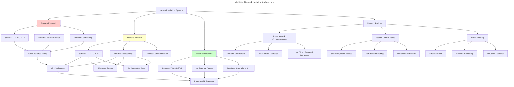

**Automated Backup and Recovery System**

A comprehensive backup and disaster recovery solution that provides automated data protection with integrity verification and selective restore capabilities for the entire n8n Docker Stack.

**Core Functionality: Automated Backup and Recovery System**

- **Comprehensive Backup**: Automated backup of PostgreSQL database, n8n data volumes, configuration files, and workflow definitions
- **Integrity Verification**: Backup integrity checking with checksums and validation to ensure reliable restore operations
- **Retention Management**: Configurable backup retention policies with automated cleanup of old backups
- **Selective Restore**: Granular restore options for database, n8n data, configurations, or complete system recovery

**Architecture Diagram of component: Automated Backup and Recovery System**

```mermaid
---
title: Automated Backup and Recovery Architecture
---
flowchart TD
    A["Backup and Recovery System"] --> B["Backup Engine"]
    A --> C["Restore Engine"]
    A --> D["Integrity Verification"]
    A --> E["Storage Management"]
    
    B --> F["Database Backup"]
    B --> G["Volume Backup"]
    B --> H["Configuration Backup"]
    B --> I["Workflow Backup"]
    
    F --> J["PostgreSQL pg_dump"]
    F --> K["SQL Export Compression"]
    F --> L["Database Schema Backup"]
    
    G --> M["n8n Data Volume"]
    G --> N["Ollama Model Data"]
    G --> O["Monitoring Data"]
    
    H --> P["Docker Compose Files"]
    H --> Q["Environment Files"]
    H --> R["Nginx Configuration"]
    H --> S["Security Settings"]
    
    I --> T["JSON Workflow Files"]
    I --> U["Workflow Metadata"]
    I --> V["Credential Backup"]
    
    C --> W["Database Restore"]
    C --> X["Volume Restore"]
    C --> Y["Configuration Restore"]
    C --> Z["Selective Recovery"]
    
    W --> AA["SQL Import Process"]
    W --> BB["Schema Recreation"]
    W --> CC["Data Consistency Check"]
    
    X --> DD["Volume Extraction"]
    X --> EE["File System Restore"]
    X --> FF["Permission Restoration"]
    
    Y --> GG["Config File Restoration"]
    Y --> HH["Environment Rebuilding"]
    Y --> II["Service Reconfiguration"]
    
    Z --> JJ["--database Option"]
    Z --> KK["--n8n-data Option"]
    Z --> LL["--configs Option"]
    Z --> MM["--workflows Option"]
    
    D --> NN["Checksum Verification"]
    D --> OO["Archive Integrity"]
    D --> PP["Backup Validation"]
    
    NN --> QQ["SHA256 Checksums"]
    OO --> RR["Compression Test"]
    PP --> SS["Restore Test"]
    
    E --> TT["Retention Policy"]
    E --> UU["Cleanup Automation"]
    E --> VV["Storage Monitoring"]
    
    TT --> WW["30-Day Retention"]
    UU --> XX["Old Backup Removal"]
    VV --> YY["Disk Space Monitoring"]
    
    A --> ZZ["Backup Reporting"]
    ZZ --> AAA["Backup Status"]
    ZZ --> BBB["Size Statistics"]
    ZZ --> CCC["Error Logging"]
```
