# n8n Docker Stack Use Cases

Note: This use_case.md is specific to the n8n Docker Stack implementation. Each use-case describes specific functionality implemented in this automation platform.

**project directories**
- src/n8n/src/docker-compose.yml - Multi-service orchestration configuration
- src/n8n/src/Dockerfile - Custom n8n image with jq and zip utilities
- src/n8n/src/scripts/ - Workflow import automation scripts
- src/n8n/src/workflows/ - Pre-configured workflow JSON definitions
- src/n8n/src/localfiles/ - File operations directory with FastAPI example server
- src/monitoring/ - Comprehensive monitoring stack with Prometheus, Grafana, and AlertManager

This project provides a complete Docker-based n8n workflow automation platform with PostgreSQL database, automatic workflow import, AI integration capabilities, and comprehensive monitoring and observability stack.

## USE-CASE: Automated Workflow Platform Deployment

**Feature 1: Complete Stack Deployment**

|| definition |
|--|--|
| GIVEN | A user has Docker and Docker Compose installed on their system |
| WHEN | They run `docker-compose up -d` in the src/ directory |
| THEN | A complete n8n automation platform is deployed with PostgreSQL database, workflow import, and AI integration |

**State Diagram: Logic flow within feature**

This diagram shows the deployment sequence and service dependencies for the complete n8n stack.

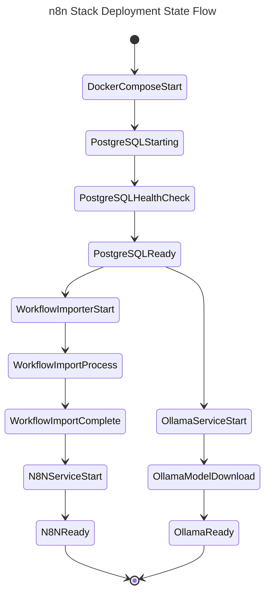

**Sequence Diagram: Interactions between systems to enable Feature**

This flowchart shows the interaction between Docker Compose services during deployment.

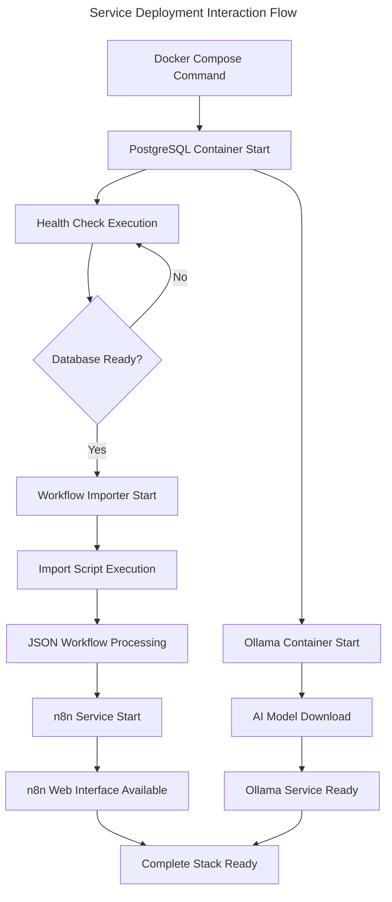

**Data Entity Relationship: Data structure for entities in Feature**

This diagram shows the data relationships between n8n components and storage systems.

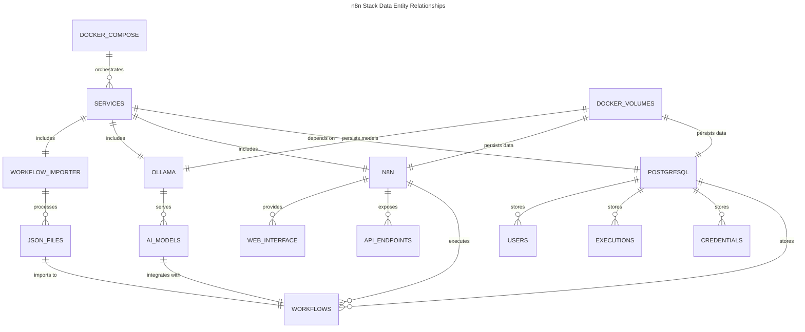

## USE-CASE: Automatic Workflow Import and Management

**Feature 1: JSON Workflow Import Automation**

|| definition |
|--|--|
| GIVEN | JSON workflow files are placed in the src/workflows directory |
| WHEN | The Docker stack is started or restarted |
| THEN | All workflow files are automatically imported into n8n with duplicate detection |

**State Diagram: Logic flow within feature**

This diagram shows the workflow import process with duplicate detection logic.

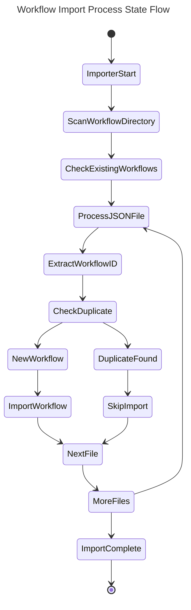

## USE-CASE: AI-Powered Workflow Automation

**Feature 1: Ollama AI Integration for Workflows**

|| definition |
|--|--|
| GIVEN | The Ollama service is running with llama3.2:3b model |
| WHEN | An n8n workflow includes AI processing nodes |
| THEN | The workflow can leverage local AI capabilities for text processing and generation |

**State Diagram: Logic flow within feature**

This diagram shows the AI integration workflow execution process.

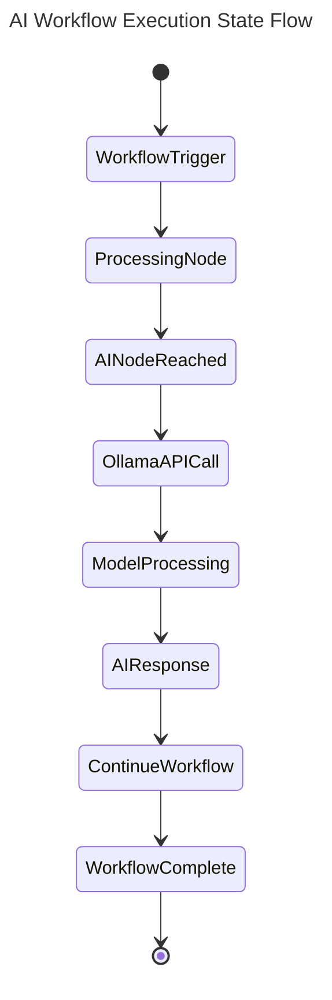

## USE-CASE: GitHub Repository Workflow Synchronization

**Feature 1: Bidirectional GitHub Workflow Sync**

|| definition |
|--|--|
| GIVEN | A GitHub repository contains n8n workflow JSON files and GitHub PAT is configured |
| WHEN | The github_repo_workflows_sync workflow is triggered (weekly or manually) |
| THEN | Workflows are synchronized bidirectionally between n8n instance and GitHub repository |

**State Diagram: Logic flow within feature**

This diagram shows the GitHub synchronization process with conflict resolution.

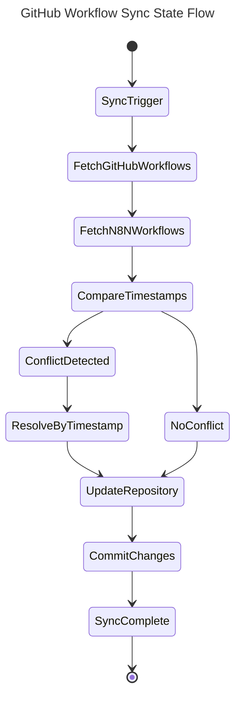

## USE-CASE: Project Tree Generation and Management

**Feature 1: Automated Project Tree Creation**

|| definition |
|--|--|
| GIVEN | A project directory structure exists with various files and folders |
| WHEN | The gtree_creator workflow is executed with project path input |
| THEN | A comprehensive project tree structure is generated and stored for documentation purposes |

**State Diagram: Logic flow within feature**

This diagram shows the project tree generation workflow process.

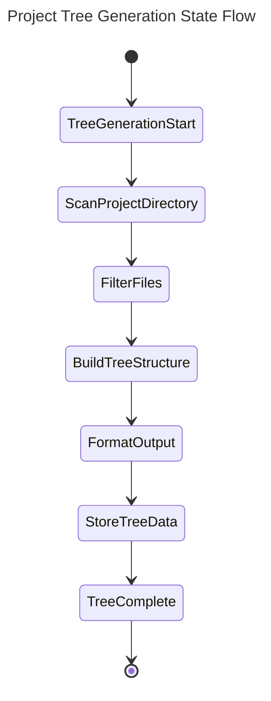

## USE-CASE: File Archive Management

**Feature 1: Automated ZIP Archive Creation and Distribution**

|| definition |
|--|--|
| GIVEN | Files need to be archived and distributed from the local file system |
| WHEN | The zip_make and zip_send workflows are triggered with file specifications |
| THEN | Files are compressed into ZIP archives and distributed to specified destinations |

**State Diagram: Logic flow within feature**

This diagram shows the file archiving and distribution process.

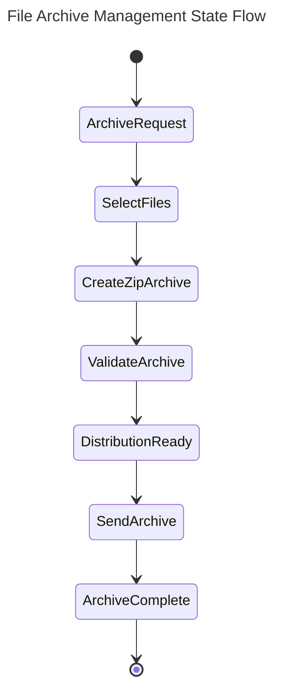

## USE-CASE: Workflow Cleanup and Maintenance

**Feature 1: Archived Workflow Deletion**

|| definition |
|--|--|
| GIVEN | n8n instance contains archived or obsolete workflows |
| WHEN | The delete_archived_workflows workflow is executed |
| THEN | Archived workflows are identified and safely removed from the n8n instance |

**State Diagram: Logic flow within feature**

This diagram shows the workflow cleanup process with safety checks.

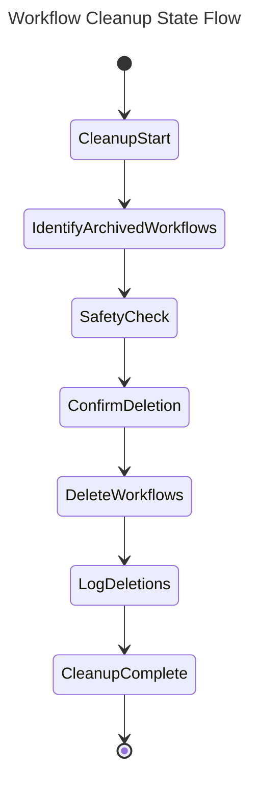

## USE-CASE: External Service Integration and Testing

**Feature 1: FastAPI Server Integration for Workflow Testing**

|| definition |
|--|--|
| GIVEN | A FastAPI server is available in the localfiles/someserver directory with sample endpoints |
| WHEN | n8n workflows need to test HTTP requests or integrate with external APIs |
| THEN | The FastAPI server provides test endpoints (/ and /items/{item_id}) for development and validation of HTTP-based workflow nodes |

**State Diagram: Logic flow within feature**

This diagram shows the external service integration process for workflow testing with the actual FastAPI endpoints.

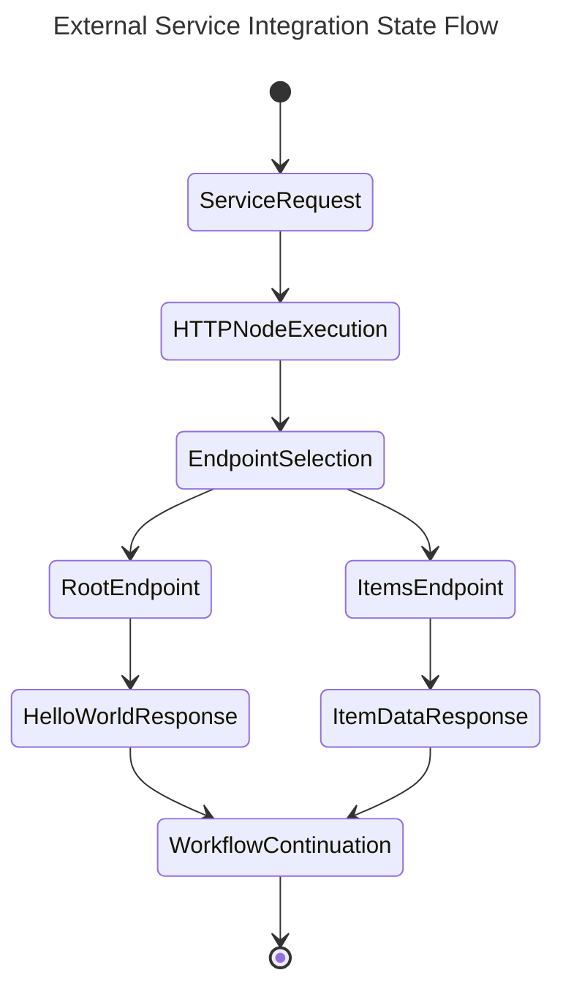

**Sequence Diagram: Interactions between systems to enable Feature**

This flowchart shows the interaction between n8n workflows and the FastAPI server for testing HTTP operations.

```mermaid
---
title: FastAPI Integration Sequence Flow
---
flowchart TD
    A["n8n HTTP Request Node"] --> B["FastAPI Server :8010"]
    B --> C{"Endpoint Selection"}
    C -->|GET /| D["Root Endpoint Handler"]
    C -->|GET /items/{id}| E["Items Endpoint Handler"]
    D --> F["Return Hello World JSON"]
    E --> G["Return Item Data JSON"]
    F --> H["n8n Response Processing"]
    G --> H
    H --> I["Continue Workflow Execution"]
```

**Data Entity Relationship: Data structure for entities in Feature**

This diagram shows the data relationships for the FastAPI server integration.

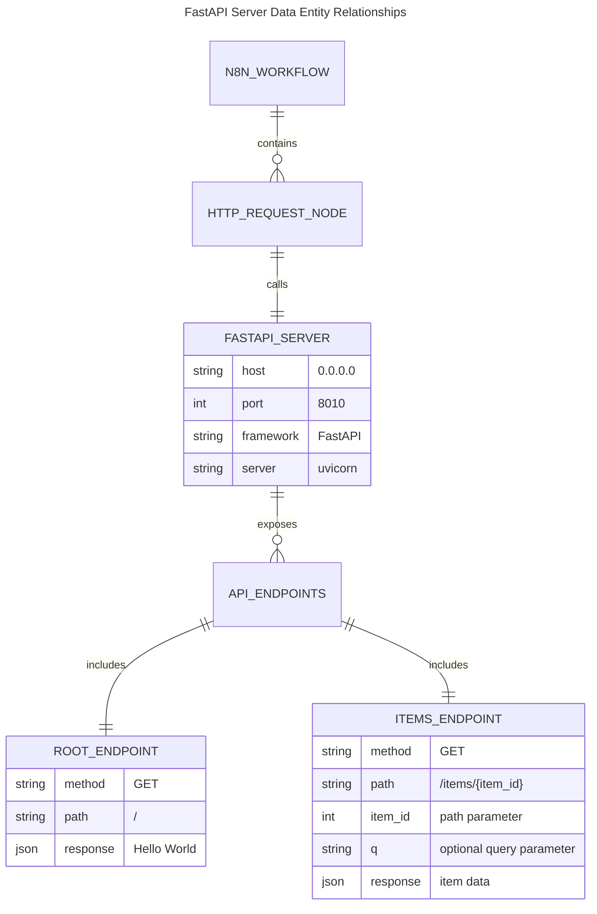

## USE-CASE: Comprehensive Workflow Collection Management

**Feature 1: Pre-configured Workflow Ecosystem**

|| definition |
|--|--|
| GIVEN | The system contains 9 pre-configured workflows covering GitHub sync, project analysis, file management, and cleanup operations |
| WHEN | The Docker stack is deployed and workflows are automatically imported |
| THEN | A complete automation ecosystem is available including GitHub synchronization, project tree generation, file archiving, and workflow maintenance |

**State Diagram: Logic flow within feature**

This diagram shows the comprehensive workflow ecosystem initialization and operation.

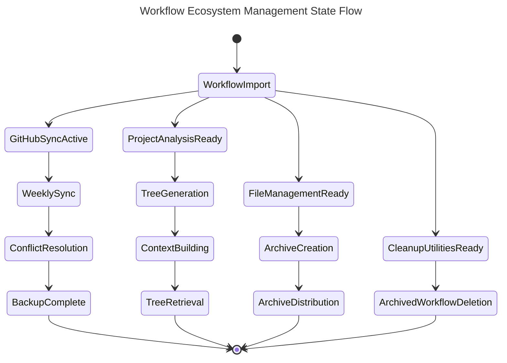

**Sequence Diagram: Interactions between systems to enable Feature**

This flowchart shows how the different workflow categories interact within the ecosystem.

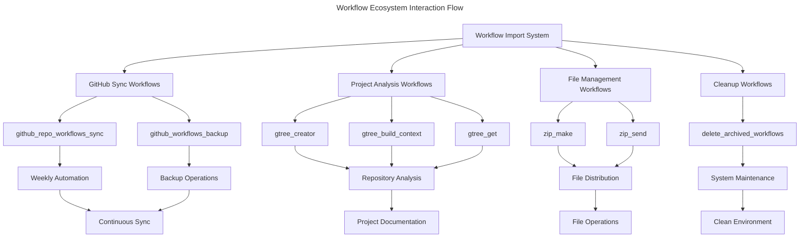

**Data Entity Relationship: Data structure for entities in Feature**

This diagram shows the relationships between different workflow categories and their data dependencies.


## USE-CASE: Comprehensive Monitoring and Observability

**Feature 1: Complete Stack Monitoring with Prometheus, Grafana, and AlertManager**

|| definition |
|--|--|
| GIVEN | The n8n Docker stack is running with monitoring services deployed |
| WHEN | Users access Grafana dashboards and Prometheus metrics |
| THEN | Complete observability is provided for all services including n8n, PostgreSQL, Ollama, and system resources |

**State Diagram: Logic flow within feature**

This diagram shows the monitoring stack initialization and data collection process.

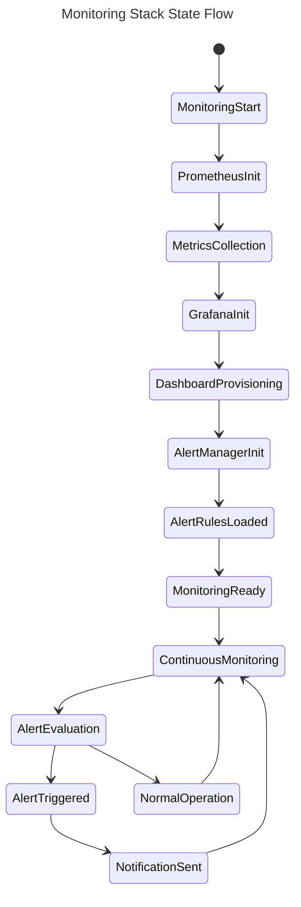

**Sequence Diagram: Interactions between systems to enable Feature**

This flowchart shows the interaction between monitoring components and monitored services.

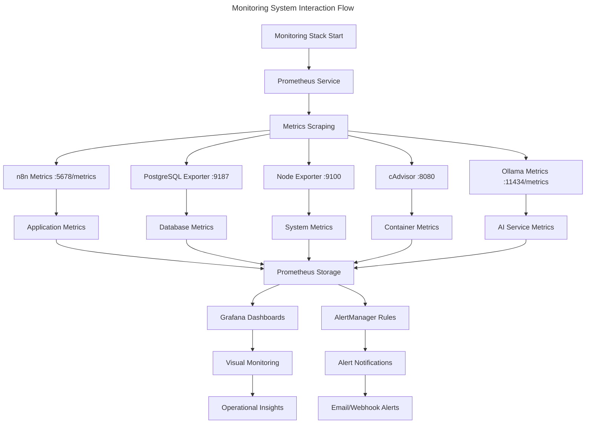

## USE-CASE: Real-time Performance Monitoring and Alerting

**Feature 1: Automated Alert System with Multi-channel Notifications**

|| definition |
|--|--|
| GIVEN | Monitoring stack is configured with alert rules for service health, resource usage, and database performance |
| WHEN | System metrics exceed defined thresholds or services become unavailable |
| THEN | Alerts are automatically triggered and routed to appropriate notification channels (email, webhooks, n8n workflows) |

**State Diagram: Logic flow within feature**

This diagram shows the alert processing and notification workflow.

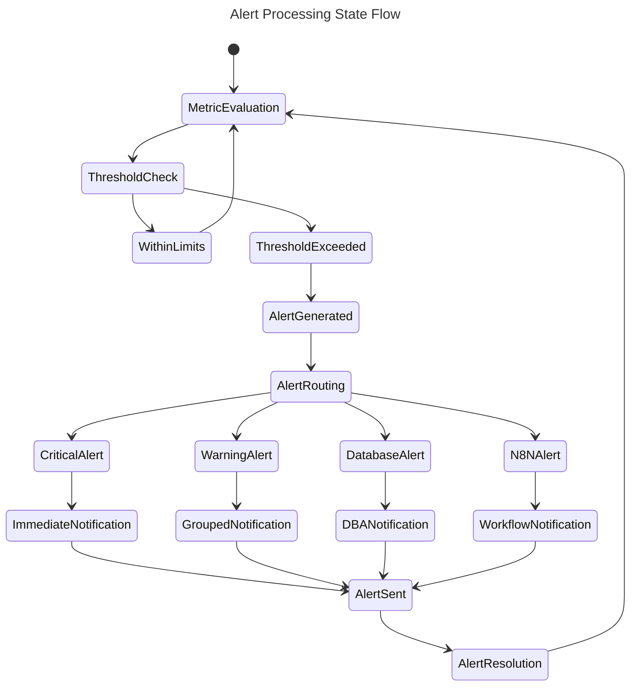

## USE-CASE: Historical Data Analysis and Capacity Planning

**Feature 1: Long-term Metrics Storage and Trend Analysis**

|| definition |
|--|--|
| GIVEN | Prometheus is configured with 30-day data retention and Grafana dashboards show historical trends |
| WHEN | Administrators need to analyze system performance over time or plan for capacity changes |
| THEN | Historical metrics data is available for trend analysis, capacity planning, and performance optimization |

**Data Entity Relationship: Data structure for entities in Feature**

This diagram shows the relationships between monitoring components and their data storage.


## USE-CASE: Monitoring Stack Deployment and Integration

**Feature 1: Comprehensive Monitoring Stack Deployment with Service Discovery**

|| definition |
|--|--|
| GIVEN | The n8n Docker stack is running and the monitoring configuration files are properly set up |
| WHEN | Users execute the monitoring deployment command `docker-compose -f docker-compose.monitoring.yml up -d` |
| THEN | A complete monitoring ecosystem is deployed with Prometheus, Grafana, AlertManager, and all exporters automatically discovering and monitoring the n8n services |

**State Diagram: Logic flow within feature**

This diagram shows the monitoring stack deployment process with automatic service discovery and configuration.

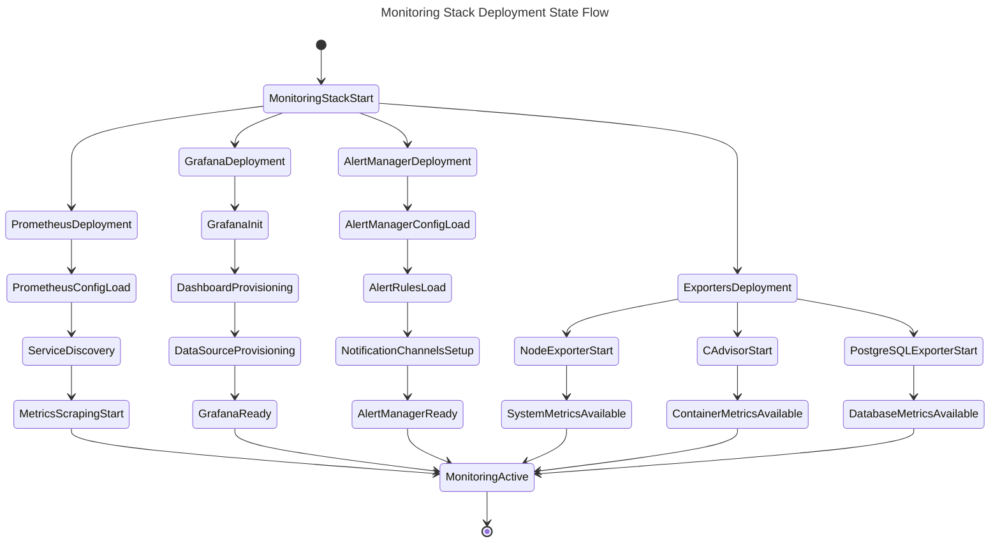

**Sequence Diagram: Interactions between systems to enable Feature**

This flowchart shows the interaction between monitoring deployment components and their service discovery process.

```mermaid
---
title: Monitoring Deployment Interaction Flow
---
flowchart TD
    A["Docker Compose Monitoring Command"] --> B["Prometheus Container Start"]
    A --> C["Grafana Container Start"]
    A --> D["AlertManager Container Start"]
    A --> E["Exporter Containers Start"]
    
    B --> F["Load prometheus.yml Configuration"]
    F --> G["Service Discovery Initialization"]
    G --> H["Scrape Target Registration"]
    
    H --> I["n8n Service :5678/metrics"]
    H --> J["PostgreSQL Exporter :9187"]
    H --> K["Node Exporter :9100"]
    H --> L["cAdvisor :8080"]
    H --> M["Ollama Service :11434/metrics"]
    
    C --> N["Load Grafana Configuration"]
    N --> O["Dashboard Provisioning Process"]
    O --> P["DataSource Auto-Configuration"]
    P --> Q["Prometheus Connection Established"]
    
    D --> R["Load alertmanager.yml"]
    R --> S["Alert Rules Processing"]
    S --> T["Notification Channel Setup"]
    
    E --> U["Node Exporter Metrics Collection"]
    E --> V["cAdvisor Container Monitoring"]
    E --> W["PostgreSQL Database Monitoring"]
    
    I --> X["Application Health Metrics"]
    J --> Y["Database Performance Data"]
    K --> Z["System Resource Metrics"]
    L --> AA["Container Resource Data"]
    M --> BB["AI Service Health Data"]
    
    X --> CC["Prometheus Time-Series Storage"]
    Y --> CC
    K --> CC
    AA --> CC
    BB --> CC
    
    CC --> DD["Grafana Dashboard Updates"]
    CC --> EE["Alert Rule Evaluation"]
    
    EE --> FF["Alert Notifications"]
    DD --> GG["Visual Monitoring Interface"]
```

## USE-CASE: Automated Testing and Verification of Monitoring Stack

**Feature 1: Comprehensive Monitoring Stack Testing with Health Validation**

|| definition |
|--|--|
| GIVEN | The monitoring stack is deployed with test-monitoring.sh and verify-integration.sh scripts available |
| WHEN | Users execute the monitoring test scripts to validate the complete stack functionality |
| THEN | All monitoring components are tested for health, connectivity, metrics collection, dashboard functionality, and alert processing with detailed pass/fail reporting |

**State Diagram: Logic flow within feature**

This diagram shows the comprehensive testing and verification process for the monitoring stack.

```mermaid
---
title: Monitoring Stack Testing State Flow
---
stateDiagram-v2
    [*] --> TestingStart
    TestingStart --> ContainerStatusCheck
    ContainerStatusCheck --> ServiceHealthTests
    ServiceHealthTests --> NetworkConnectivityTests
    NetworkConnectivityTests --> MetricsCollectionTests
    MetricsCollectionTests --> DashboardTests
    DashboardTests --> AlertSystemTests
    AlertSystemTests --> IntegrationTests
    IntegrationTests --> TestResults
    
    ContainerStatusCheck --> PrometheusContainerCheck
    ContainerStatusCheck --> GrafanaContainerCheck
    ContainerStatusCheck --> AlertManagerContainerCheck
    ContainerStatusCheck --> ExporterContainerCheck
    
    ServiceHealthTests --> PrometheusHealthAPI
    ServiceHealthTests --> GrafanaHealthAPI
    ServiceHealthTests --> AlertManagerHealthAPI
    ServiceHealthTests --> ExporterHealthChecks
    
    MetricsCollectionTests --> PrometheusTargetsCheck
    MetricsCollectionTests --> NodeExporterMetrics
    MetricsCollectionTests --> CAdvisorMetrics
    MetricsCollectionTests --> PostgreSQLExporterMetrics
    
    DashboardTests --> GrafanaDashboardLoad
    DashboardTests --> DataSourceConnectivity
    DashboardTests --> DashboardRendering
    
    AlertSystemTests --> AlertRulesValidation
    AlertSystemTests --> AlertManagerConfig
    AlertSystemTests --> NotificationChannels
    
    IntegrationTests --> N8NStackIntegration
    IntegrationTests --> DocumentationVerification
    IntegrationTests --> ConfigurationValidation
    
    TestResults --> AllTestsPassed
    TestResults --> SomeTestsFailed
    
    AllTestsPassed --> [*]
    SomeTestsFailed --> [*]
```

**Sequence Diagram: Interactions between systems to enable Feature**

This flowchart shows the interaction between test scripts and monitoring components during validation.

```mermaid
---
title: Monitoring Testing Interaction Flow
---
flowchart TD
    A["Test Script Execution"] --> B["Container Status Verification"]
    B --> C["Service Health API Calls"]
    C --> D["Metrics Endpoint Testing"]
    D --> E["Dashboard Functionality Tests"]
    E --> F["Alert System Validation"]
    F --> G["Integration Verification"]
    
    B --> H["Docker PS Commands"]
    H --> I["Container Name Validation"]
    I --> J["Container Running Status"]
    
    C --> K["Prometheus /-/healthy"]
    C --> L["Grafana /api/health"]
    C --> M["AlertManager /-/healthy"]
    C --> N["Exporter Metrics Endpoints"]
    
    D --> O["Prometheus /api/v1/targets"]
    D --> P["Node Exporter /metrics"]
    D --> Q["cAdvisor /metrics"]
    D --> R["PostgreSQL Exporter /metrics"]
    
    E --> S["Grafana Dashboard API"]
    E --> T["DataSource API Validation"]
    E --> U["Dashboard Rendering Tests"]
    
    F --> V["Alert Rules API"]
    F --> W["AlertManager Configuration"]
    F --> X["Notification Channel Tests"]
    
    G --> Y["n8n Stack Network Check"]
    G --> Z["Documentation Completeness"]
    G --> AA["Configuration File Validation"]
    
    J --> BB["Test Results Aggregation"]
    K --> BB
    L --> BB
    M --> BB
    N --> BB
    
    O --> CC["Metrics Validation"]
    P --> CC
    Q --> CC
    R --> CC
    
    S --> DD["Dashboard Validation"]
    T --> DD
    U --> DD
    
    V --> EE["Alert System Validation"]
    W --> EE
    X --> EE
    
    Y --> FF["Integration Validation"]
    Z --> FF
    AA --> FF
    
    BB --> GG["Final Test Report"]
    CC --> GG
    DD --> GG
    EE --> GG
    FF --> GG
```

**Data Entity Relationship: Data structure for entities in Feature**

This diagram shows the relationships between test components and their validation targets.

```mermaid
---
title: Monitoring Diagnostics Data Entity Relationships
---
erDiagram
    DIAGNOSTIC_TESTS ||--o{ TEST_RESULTS : produces
    TEST_RESULTS ||--o{ REMEDIATION_ACTIONS : triggers
    SERVICE_HEALTH ||--o{ DIAGNOSTIC_TESTS : initiates
    
    DIAGNOSTIC_TESTS {
        string test_id
        string test_name
        string service_name
        timestamp execution_time
        string test_type
        json test_parameters
        string status
    }
    
    TEST_RESULTS {
        string result_id
        string test_case_id
        string status
        string error_message
        json result_data
        float execution_duration
        timestamp completion_time
    }
    
    SERVICE_HEALTH {
        string service_name
        string health_status
        timestamp last_check
        float uptime_percentage
        string endpoint_url
        json health_metrics
    }
    
    REMEDIATION_ACTIONS {
        string action_id
        string test_result_id
        string action_type
        string description
        string script_command
        string status
        timestamp executed_at
    }
    
    CONFIGURATION_VALIDATION ||--o{ DIAGNOSTIC_TESTS : validates
    CONFIGURATION_VALIDATION {
        string config_id
        string config_file_path
        string validation_status
        json validation_errors
        timestamp last_validated
    }
```

## USE-CASE: Security Hardening and Production Readiness

**Feature 1: Comprehensive Security Stack Deployment**

|| definition |
|--|--|
| GIVEN | A development n8n Docker Stack requires production security hardening |
| WHEN | The security setup script is executed and security-enhanced Docker Compose is deployed |
| THEN | A production-ready n8n instance is available with HTTPS, network isolation, intrusion prevention, and secure credential management |

**State Diagram: Logic flow within feature**

This diagram shows the security hardening process from development to production deployment.

```mermaid
---
title: Security Hardening Deployment State Flow
---
stateDiagram-v2
    [*] --> SecuritySetupInit
    SecuritySetupInit --> CredentialGeneration
    CredentialGeneration --> SSLCertificateSetup
    SSLCertificateSetup --> NetworkIsolationConfig
    NetworkIsolationConfig --> NginxReverseProxySetup
    NginxReverseProxySetup --> Fail2banConfiguration
    Fail2banConfiguration --> SecurityValidation
    SecurityValidation --> ProductionDeployment
    ProductionDeployment --> [*]
```

**Sequence Diagram: Interactions between systems to enable Feature**

This flowchart shows the security component initialization and integration process.

```mermaid
---
title: Security Stack Integration Flow
---
flowchart TD
    A["Security Setup Script"] --> B["Generate Docker Secrets"]
    B --> C["Create SSL Certificates"]
    C --> D["Configure Network Isolation"]
    D --> E["Setup Nginx Reverse Proxy"]
    E --> F["Configure Fail2ban Rules"]
    F --> G["Deploy Security Stack"]
    G --> H["Validate Security Configuration"]
    H --> I["HTTPS n8n Access Available"]
    
    B --> J["PostgreSQL Credentials"]
    B --> K["n8n Authentication"]
    B --> L["Grafana Admin Access"]
    B --> M["Encryption Keys"]
    
    C --> N["Self-signed Development"]
    C --> O["CA-signed Production Ready"]
    
    D --> P["Frontend Network"]
    D --> Q["Backend Network"]
    D --> R["Database Network"]
    
    E --> S["SSL Termination"]
    E --> T["Security Headers"]
    E --> U["Rate Limiting"]
    E --> V["WebSocket Support"]
    
    F --> W["Authentication Failure Detection"]
    F --> X["Rate Limit Violation Monitoring"]
    F --> Y["Automated IP Blocking"]
```

**Data Entity Relationship: Data structure for entities in Feature**

This diagram shows the security component relationships and data flow.

```mermaid
---
title: Security Stack Data Entity Relationships
---
erDiagram
    SECURITY_STACK ||--o{ DOCKER_SECRETS : manages
    SECURITY_STACK ||--o{ NETWORK_ISOLATION : implements
    SECURITY_STACK ||--o{ NGINX_PROXY : includes
    SECURITY_STACK ||--o{ FAIL2BAN_IPS : includes
    
    DOCKER_SECRETS ||--o{ SERVICE_CREDENTIALS : stores
    NETWORK_ISOLATION ||--o{ NETWORK_TIERS : defines
    NGINX_PROXY ||--o{ SSL_CERTIFICATES : uses
    FAIL2BAN_IPS ||--o{ BLOCKED_IPS : tracks
    
    SERVICE_CREDENTIALS {
        string service_name
        string credential_type
        string secret_file
        timestamp created_date
        boolean is_encrypted
    }
    
    NETWORK_TIERS {
        string network_name
        string subnet_range
        boolean external_access
        json access_rules
    }
    
    SSL_CERTIFICATES {
        string cert_type
        string cert_path
        string key_path
        timestamp expiry_date
        boolean is_valid
    }
    
    BLOCKED_IPS {
        string ip_address
        string ban_reason
        timestamp ban_time
        int ban_duration
        string jail_name
    }
```

**Feature 2: Network Security and Access Control**

|| definition |
|--|--|
| GIVEN | Multi-tier network architecture with frontend, backend, and database networks |
| WHEN | Security-enhanced Docker Compose is deployed with network isolation |
| THEN | Services are isolated by function with controlled communication paths and no direct database access from external networks |

**State Diagram: Logic flow within feature**

This diagram shows the network security enforcement and access control flow.

```mermaid
---
title: Network Security Access Control State Flow
---
stateDiagram-v2
    [*] --> ExternalRequest
    ExternalRequest --> FrontendNetwork
    FrontendNetwork --> NginxReverseProxy
    NginxReverseProxy --> SecurityHeaderCheck
    SecurityHeaderCheck --> RateLimitCheck
    RateLimitCheck --> BackendNetwork
    BackendNetwork --> n8nApplication
    n8nApplication --> DatabaseNetwork
    DatabaseNetwork --> PostgreSQLAccess
    PostgreSQLAccess --> [*]
    
    RateLimitCheck --> Fail2banTrigger
    Fail2banTrigger --> IPBlocked
    IPBlocked --> [*]
```

## USE-CASE: Automated Backup and Disaster Recovery

**Feature 1: Comprehensive Automated Backup System**

|| definition |
|--|--|
| GIVEN | A running n8n Docker Stack with PostgreSQL database, n8n data, and configuration files |
| WHEN | The automated backup script is executed manually or via scheduled cron job |
| THEN | Complete system backup is created including database dump, volume data, configurations, and workflows with integrity verification |

**State Diagram: Logic flow within feature**

This diagram shows the comprehensive backup process with verification and cleanup.

```mermaid
---
title: Automated Backup Process State Flow
---
stateDiagram-v2
    [*] --> BackupInitialization
    BackupInitialization --> ContainerHealthCheck
    ContainerHealthCheck --> DatabaseBackup
    DatabaseBackup --> VolumeBackup
    VolumeBackup --> ConfigurationBackup
    ConfigurationBackup --> WorkflowBackup
    WorkflowBackup --> IntegrityVerification
    IntegrityVerification --> BackupCompression
    BackupCompression --> RetentionCleanup
    RetentionCleanup --> BackupReport
    BackupReport --> [*]
    
    ContainerHealthCheck --> BackupFailure
    DatabaseBackup --> BackupFailure
    VolumeBackup --> BackupFailure
    IntegrityVerification --> BackupFailure
    BackupFailure --> [*]
```

**Sequence Diagram: Interactions between systems to enable Feature**

This flowchart shows the backup system interaction with Docker containers and storage.

```mermaid
---
title: Backup System Interaction Flow
---
flowchart TD
    A["Backup Script Execution"] --> B["Docker Container Status Check"]
    B --> C["PostgreSQL Container"]
    B --> D["n8n Container"]
    B --> E["Volume Access"]
    
    C --> F["pg_dump Database Export"]
    F --> G["SQL Compression"]
    
    E --> H["n8n Data Volume"]
    E --> I["Ollama Model Data"]
    E --> J["Monitoring Data"]
    
    H --> K["Volume Archive Creation"]
    I --> K
    J --> K
    
    A --> L["Configuration File Collection"]
    L --> M["Docker Compose Files"]
    L --> N["Environment Files"]
    L --> O["Security Configurations"]
    
    A --> P["Workflow Export"]
    P --> Q["JSON Workflow Files"]
    P --> R["Workflow Metadata"]
    
    G --> S["Backup Integrity Check"]
    K --> S
    M --> S
    Q --> S
    
    S --> T["Backup Archive Creation"]
    T --> U["Retention Policy Application"]
    U --> V["Backup Report Generation"]
```

**Data Entity Relationship: Data structure for entities in Feature**

This diagram shows the backup system data relationships and storage structure.

```mermaid
---
title: Backup System Data Entity Relationships
---
erDiagram
    BACKUP_SESSION ||--o{ BACKUP_COMPONENTS : includes
    BACKUP_SESSION ||--o{ BACKUP_VERIFICATION : validates
    BACKUP_SESSION ||--o{ BACKUP_REPORT : generates
    
    BACKUP_COMPONENTS ||--|| DATABASE_BACKUP : includes
    BACKUP_COMPONENTS ||--|| VOLUME_BACKUP : includes
    BACKUP_COMPONENTS ||--|| CONFIG_BACKUP : includes
    BACKUP_COMPONENTS ||--|| WORKFLOW_BACKUP : includes
    
    BACKUP_VERIFICATION ||--o{ INTEGRITY_CHECKS : performs
    BACKUP_REPORT ||--o{ BACKUP_STATISTICS : contains
    
    BACKUP_SESSION {
        string backup_id
        timestamp start_time
        timestamp end_time
        string backup_directory
        int total_size_mb
        string status
        string backup_type
    }
    
    DATABASE_BACKUP {
        string dump_file
        int size_mb
        string compression_type
        boolean integrity_verified
        string postgres_version
    }
    
    VOLUME_BACKUP {
        string volume_name
        string archive_file
        int size_mb
        int file_count
        string compression_ratio
    }
    
    CONFIG_BACKUP {
        string config_type
        string file_path
        int size_kb
        string checksum
        boolean encrypted
    }
    
    WORKFLOW_BACKUP {
        string workflow_name
        string json_file
        int size_kb
        timestamp modified_date
        boolean exported_successfully
    }
    
    INTEGRITY_CHECKS {
        string check_type
        string target_file
        string checksum_algorithm
        string calculated_hash
        boolean verification_passed
    }
    
    BACKUP_STATISTICS {
        string metric_name
        string metric_value
        string unit
        string category
    }
```

**Feature 2: Selective Disaster Recovery System**

|| definition |
|--|--|
| GIVEN | Backup archives exist for database, n8n data, configurations, and workflows |
| WHEN | The restore script is executed with specific recovery options (--database, --n8n-data, --configs, --workflows) |
| THEN | Selected components are restored to specified backup timestamp with service restart and functionality validation |

**State Diagram: Logic flow within feature**

This diagram shows the selective restore process with component-specific recovery options.

```mermaid
---
title: Selective Disaster Recovery State Flow
---
stateDiagram-v2
    [*] --> RestoreInitialization
    RestoreInitialization --> BackupSelection
    BackupSelection --> ComponentSelection
    ComponentSelection --> DatabaseRestore
    ComponentSelection --> VolumeRestore
    ComponentSelection --> ConfigRestore
    ComponentSelection --> WorkflowRestore
    
    DatabaseRestore --> ServiceStop
    VolumeRestore --> ServiceStop
    ConfigRestore --> ServiceStop
    WorkflowRestore --> ServiceStop
    
    ServiceStop --> RestoreExecution
    RestoreExecution --> IntegrityVerification
    IntegrityVerification --> ServiceRestart
    ServiceRestart --> FunctionalityTest
    FunctionalityTest --> RestoreComplete
    RestoreComplete --> [*]
    
    BackupSelection --> RestoreError
    RestoreExecution --> RestoreError
    IntegrityVerification --> RestoreError
    RestoreError --> [*]
```
