# n8n Docker Stack Use Cases

Note: This use_case.md is specific to the n8n Docker Stack implementation. Each use-case describes specific functionality implemented in this automation platform.

**project directories**
- src/n8n/src/docker-compose.yml - Multi-service orchestration configuration
- src/n8n/src/Dockerfile - Custom n8n image with jq and zip utilities
- src/n8n/src/scripts/ - Workflow import automation scripts
- src/n8n/src/workflows/ - Pre-configured workflow JSON definitions
- src/n8n/src/localfiles/ - File operations directory with FastAPI example server
- src/monitoring/ - Comprehensive monitoring stack with Prometheus, Grafana, and AlertManager

This project provides a complete Docker-based n8n workflow automation platform with PostgreSQL database, automatic workflow import, AI integration capabilities, and comprehensive monitoring and observability stack.

## USE-CASE: Automated Workflow Platform Deployment

**Feature 1: Complete Stack Deployment**

|| definition |
|--|--|
| GIVEN | A user has Docker and Docker Compose installed on their system |
| WHEN | They run `docker-compose up -d` in the src/ directory |
| THEN | A complete n8n automation platform is deployed with PostgreSQL database, workflow import, and AI integration |

**State Diagram: Logic flow within feature**

This diagram shows the deployment sequence and service dependencies for the complete n8n stack.

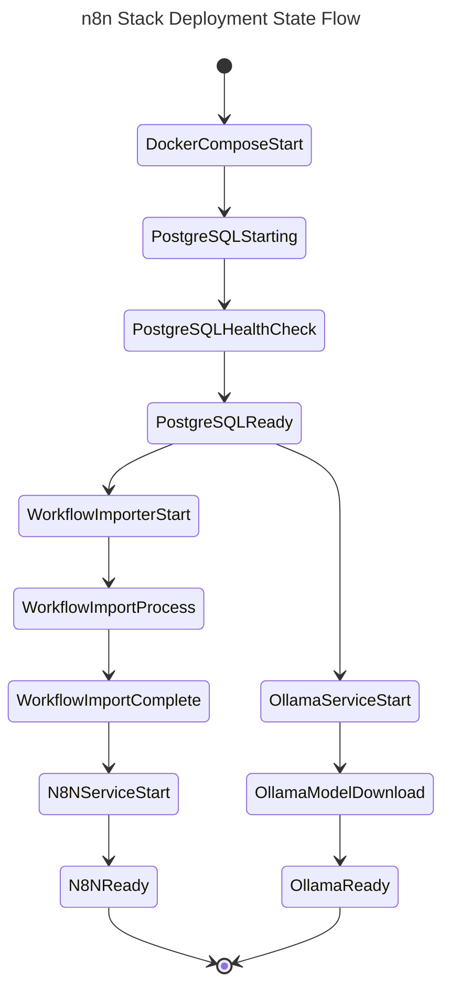

**Sequence Diagram: Interactions between systems to enable Feature**

This flowchart shows the interaction between Docker Compose services during deployment.

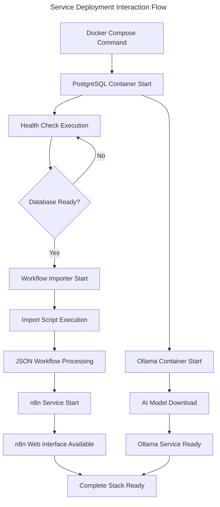

**Data Entity Relationship: Data structure for entities in Feature**

This diagram shows the data relationships between n8n components and storage systems.

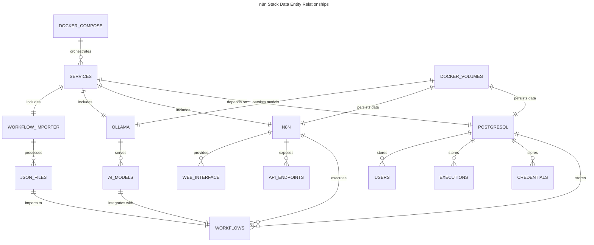

## USE-CASE: Automatic Workflow Import and Management

**Feature 1: JSON Workflow Import Automation**

|| definition |
|--|--|
| GIVEN | JSON workflow files are placed in the src/workflows directory |
| WHEN | The Docker stack is started or restarted |
| THEN | All workflow files are automatically imported into n8n with duplicate detection |

**State Diagram: Logic flow within feature**

This diagram shows the workflow import process with duplicate detection logic.

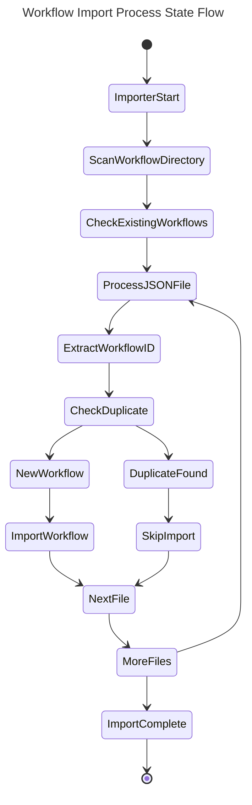

## USE-CASE: AI-Powered Workflow Automation

**Feature 1: Ollama AI Integration for Workflows**

|| definition |
|--|--|
| GIVEN | The Ollama service is running with llama3.2:3b model |
| WHEN | An n8n workflow includes AI processing nodes |
| THEN | The workflow can leverage local AI capabilities for text processing and generation |

**State Diagram: Logic flow within feature**

This diagram shows the AI integration workflow execution process.

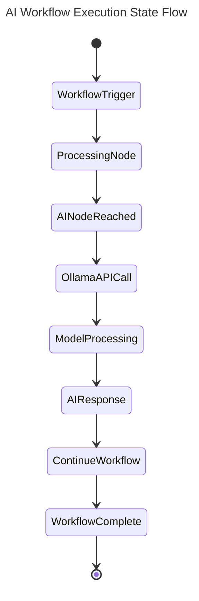

## USE-CASE: GitHub Repository Workflow Synchronization

**Feature 1: Bidirectional GitHub Workflow Sync**

|| definition |
|--|--|
| GIVEN | A GitHub repository contains n8n workflow JSON files and GitHub PAT is configured |
| WHEN | The github_repo_workflows_sync workflow is triggered (weekly or manually) |
| THEN | Workflows are synchronized bidirectionally between n8n instance and GitHub repository |

**State Diagram: Logic flow within feature**

This diagram shows the GitHub synchronization process with conflict resolution.

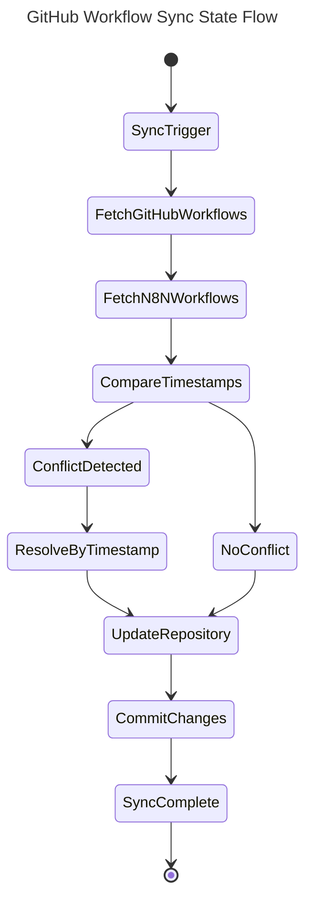

## USE-CASE: Project Tree Generation and Management

**Feature 1: Automated Project Tree Creation**

|| definition |
|--|--|
| GIVEN | A project directory structure exists with various files and folders |
| WHEN | The gtree_creator workflow is executed with project path input |
| THEN | A comprehensive project tree structure is generated and stored for documentation purposes |

**State Diagram: Logic flow within feature**

This diagram shows the project tree generation workflow process.

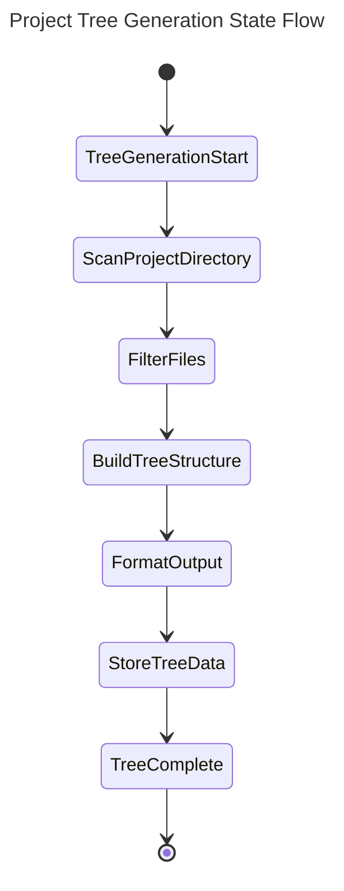

## USE-CASE: File Archive Management

**Feature 1: Automated ZIP Archive Creation and Distribution**

|| definition |
|--|--|
| GIVEN | Files need to be archived and distributed from the local file system |
| WHEN | The zip_make and zip_send workflows are triggered with file specifications |
| THEN | Files are compressed into ZIP archives and distributed to specified destinations |

**State Diagram: Logic flow within feature**

This diagram shows the file archiving and distribution process.

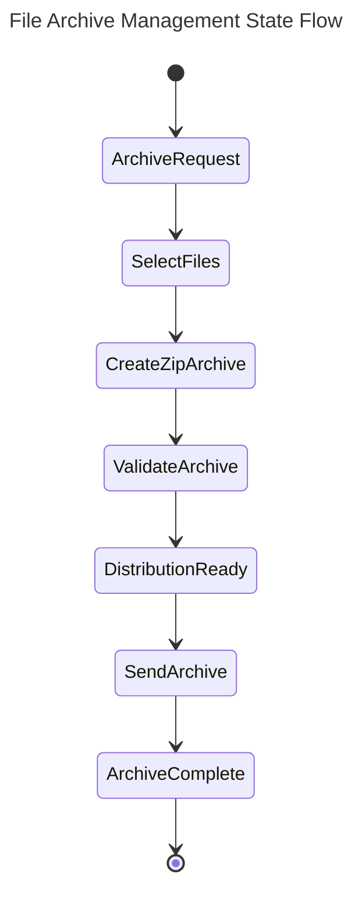

## USE-CASE: Workflow Cleanup and Maintenance

**Feature 1: Archived Workflow Deletion**

|| definition |
|--|--|
| GIVEN | n8n instance contains archived or obsolete workflows |
| WHEN | The delete_archived_workflows workflow is executed |
| THEN | Archived workflows are identified and safely removed from the n8n instance |

**State Diagram: Logic flow within feature**

This diagram shows the workflow cleanup process with safety checks.

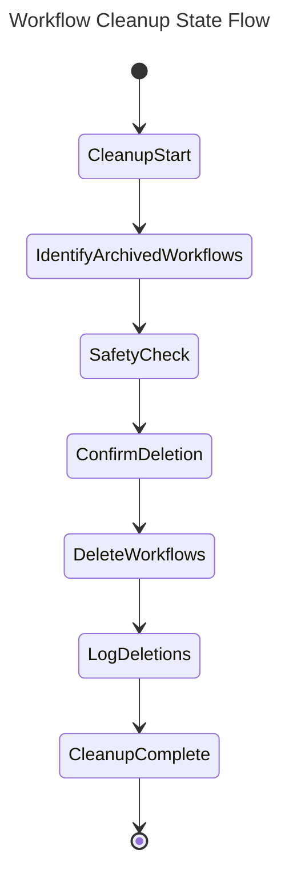

## USE-CASE: External Service Integration and Testing

**Feature 1: FastAPI Server Integration for Workflow Testing**

|| definition |
|--|--|
| GIVEN | A FastAPI server is available in the localfiles/someserver directory with sample endpoints |
| WHEN | n8n workflows need to test HTTP requests or integrate with external APIs |
| THEN | The FastAPI server provides test endpoints (/ and /items/{item_id}) for development and validation of HTTP-based workflow nodes |

**State Diagram: Logic flow within feature**

This diagram shows the external service integration process for workflow testing with the actual FastAPI endpoints.

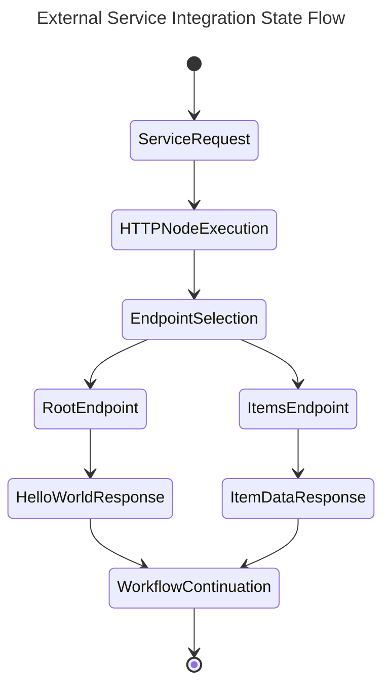

**Sequence Diagram: Interactions between systems to enable Feature**

This flowchart shows the interaction between n8n workflows and the FastAPI server for testing HTTP operations.

```mermaid
---
title: FastAPI Integration Sequence Flow
---
flowchart TD
    A["n8n HTTP Request Node"] --> B["FastAPI Server :8010"]
    B --> C{"Endpoint Selection"}
    C -->|GET /| D["Root Endpoint Handler"]
    C -->|GET /items/{id}| E["Items Endpoint Handler"]
    D --> F["Return Hello World JSON"]
    E --> G["Return Item Data JSON"]
    F --> H["n8n Response Processing"]
    G --> H
    H --> I["Continue Workflow Execution"]
```

**Data Entity Relationship: Data structure for entities in Feature**

This diagram shows the data relationships for the FastAPI server integration.

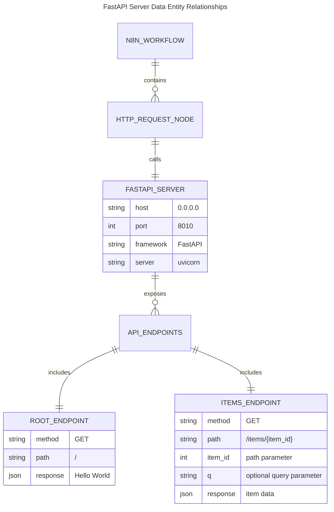

## USE-CASE: Comprehensive Workflow Collection Management

**Feature 1: Pre-configured Workflow Ecosystem**

|| definition |
|--|--|
| GIVEN | The system contains 9 pre-configured workflows covering GitHub sync, project analysis, file management, and cleanup operations |
| WHEN | The Docker stack is deployed and workflows are automatically imported |
| THEN | A complete automation ecosystem is available including GitHub synchronization, project tree generation, file archiving, and workflow maintenance |

**State Diagram: Logic flow within feature**

This diagram shows the comprehensive workflow ecosystem initialization and operation.

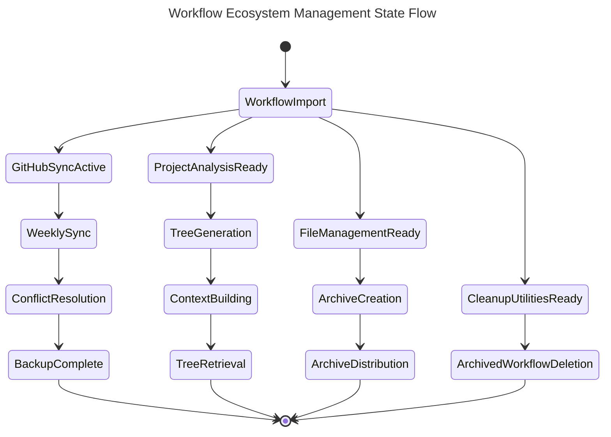

**Sequence Diagram: Interactions between systems to enable Feature**

This flowchart shows how the different workflow categories interact within the ecosystem.

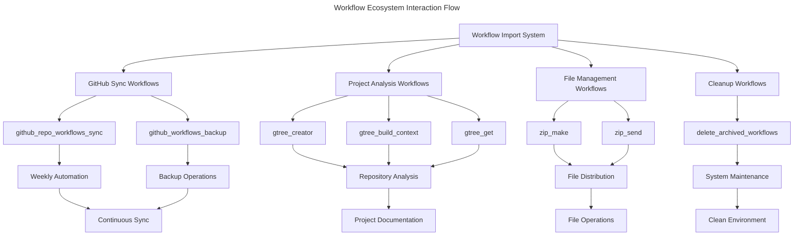

**Data Entity Relationship: Data structure for entities in Feature**

This diagram shows the relationships between different workflow categories and their data dependencies.


## USE-CASE: Comprehensive Monitoring and Observability

**Feature 1: Complete Stack Monitoring with Prometheus, Grafana, and AlertManager**

|| definition |
|--|--|
| GIVEN | The n8n Docker stack is running with monitoring services deployed |
| WHEN | Users access Grafana dashboards and Prometheus metrics |
| THEN | Complete observability is provided for all services including n8n, PostgreSQL, Ollama, and system resources |

**State Diagram: Logic flow within feature**

This diagram shows the monitoring stack initialization and data collection process.

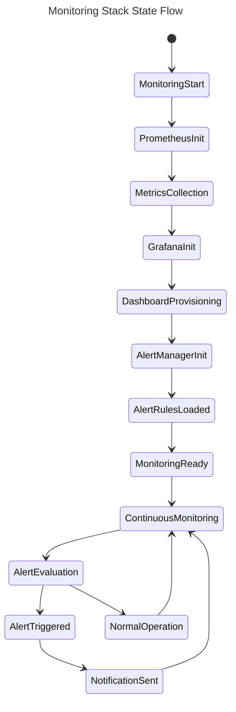

**Sequence Diagram: Interactions between systems to enable Feature**

This flowchart shows the interaction between monitoring components and monitored services.

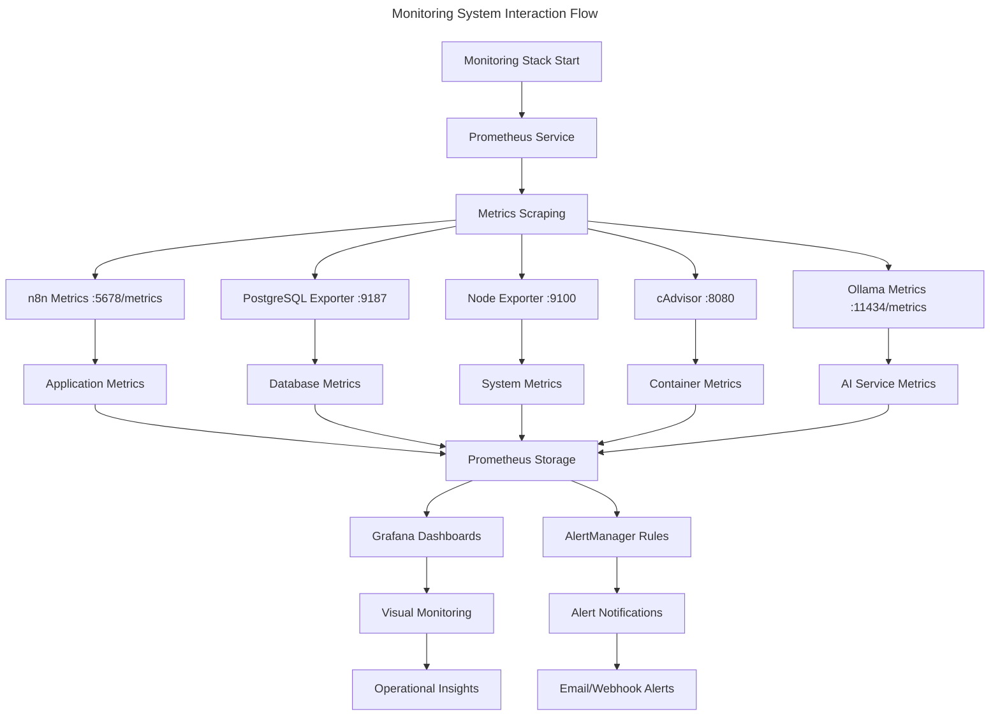

## USE-CASE: Real-time Performance Monitoring and Alerting

**Feature 1: Automated Alert System with Multi-channel Notifications**

|| definition |
|--|--|
| GIVEN | Monitoring stack is configured with alert rules for service health, resource usage, and database performance |
| WHEN | System metrics exceed defined thresholds or services become unavailable |
| THEN | Alerts are automatically triggered and routed to appropriate notification channels (email, webhooks, n8n workflows) |

**State Diagram: Logic flow within feature**

This diagram shows the alert processing and notification workflow.

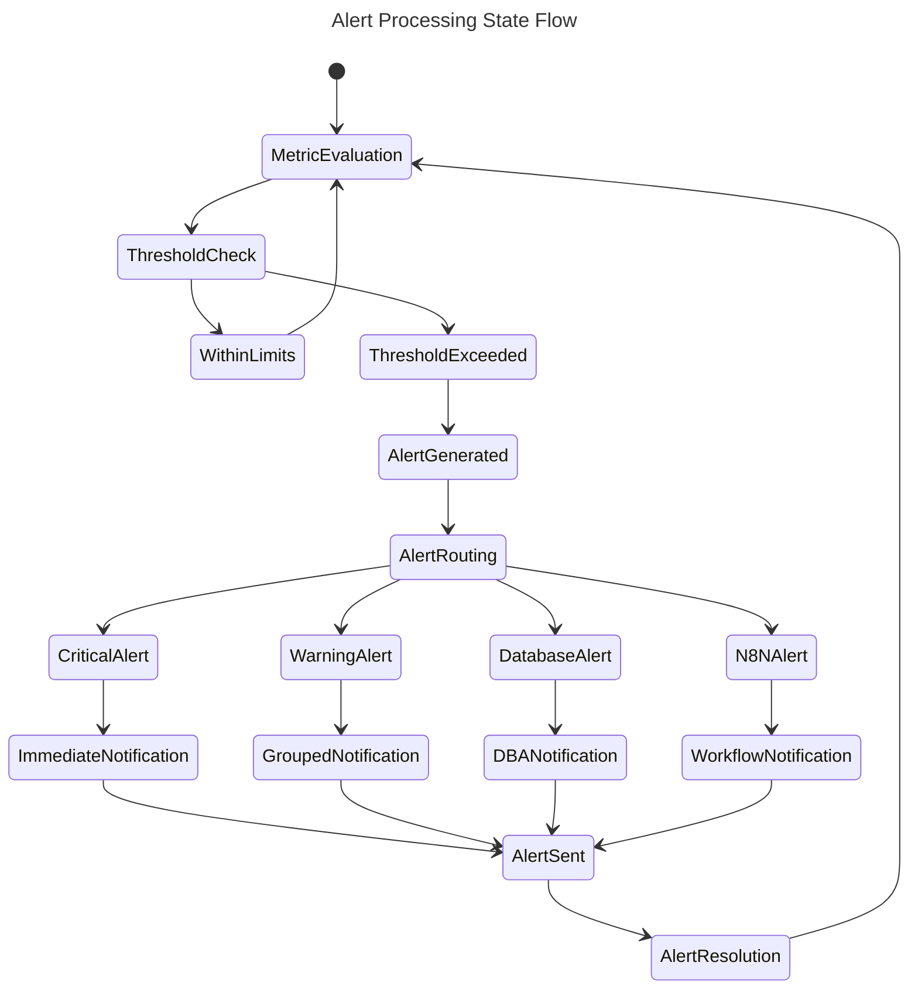

## USE-CASE: Historical Data Analysis and Capacity Planning

**Feature 1: Long-term Metrics Storage and Trend Analysis**

|| definition |
|--|--|
| GIVEN | Prometheus is configured with 30-day data retention and Grafana dashboards show historical trends |
| WHEN | Administrators need to analyze system performance over time or plan for capacity changes |
| THEN | Historical metrics data is available for trend analysis, capacity planning, and performance optimization |

**Data Entity Relationship: Data structure for entities in Feature**

This diagram shows the relationships between monitoring components and their data storage.

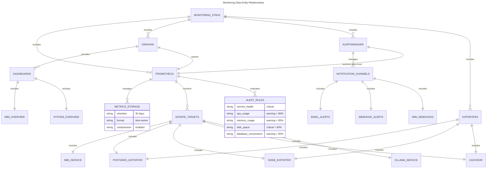

## USE-CASE: Monitoring Stack Deployment and Integration

**Feature 1: Comprehensive Monitoring Stack Deployment with Service Discovery**

|| definition |
|--|--|
| GIVEN | The n8n Docker stack is running and the monitoring configuration files are properly set up |
| WHEN | Users execute the monitoring deployment command `docker-compose -f docker-compose.monitoring.yml up -d` |
| THEN | A complete monitoring ecosystem is deployed with Prometheus, Grafana, AlertManager, and all exporters automatically discovering and monitoring the n8n services |

**State Diagram: Logic flow within feature**

This diagram shows the monitoring stack deployment process with automatic service discovery and configuration.

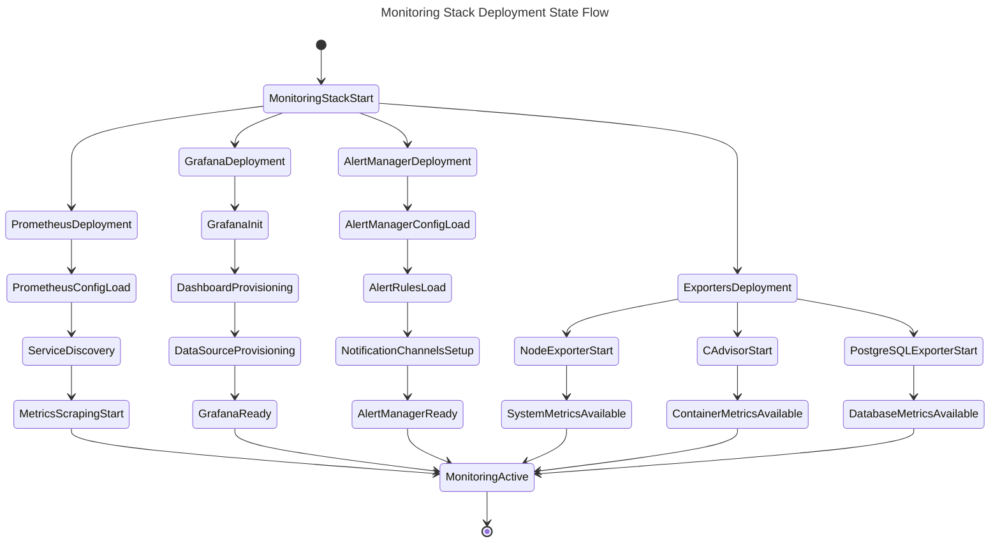

**Sequence Diagram: Interactions between systems to enable Feature**

This flowchart shows the interaction between monitoring deployment components and their service discovery process.

```mermaid
---
title: Monitoring Deployment Interaction Flow
---
flowchart TD
    A["Docker Compose Monitoring Command"] --> B["Prometheus Container Start"]
    A --> C["Grafana Container Start"]
    A --> D["AlertManager Container Start"]
    A --> E["Exporter Containers Start"]
    
    B --> F["Load prometheus.yml Configuration"]
    F --> G["Service Discovery Initialization"]
    G --> H["Scrape Target Registration"]
    
    H --> I["n8n Service :5678/metrics"]
    H --> J["PostgreSQL Exporter :9187"]
    H --> K["Node Exporter :9100"]
    H --> L["cAdvisor :8080"]
    H --> M["Ollama Service :11434/metrics"]
    
    C --> N["Load Grafana Configuration"]
    N --> O["Dashboard Provisioning Process"]
    O --> P["DataSource Auto-Configuration"]
    P --> Q["Prometheus Connection Established"]
    
    D --> R["Load alertmanager.yml"]
    R --> S["Alert Rules Processing"]
    S --> T["Notification Channel Setup"]
    
    E --> U["Node Exporter Metrics Collection"]
    E --> V["cAdvisor Container Monitoring"]
    E --> W["PostgreSQL Database Monitoring"]
    
    I --> X["Application Health Metrics"]
    J --> Y["Database Performance Data"]
    K --> Z["System Resource Metrics"]
    L --> AA["Container Resource Data"]
    M --> BB["AI Service Health Data"]
    
    X --> CC["Prometheus Time-Series Storage"]
    Y --> CC
    K --> CC
    AA --> CC
    BB --> CC
    
    CC --> DD["Grafana Dashboard Updates"]
    CC --> EE["Alert Rule Evaluation"]
    
    EE --> FF["Alert Notifications"]
    DD --> GG["Visual Monitoring Interface"]
```

## USE-CASE: Automated Testing and Verification of Monitoring Stack

**Feature 1: Comprehensive Monitoring Stack Testing with Health Validation**

|| definition |
|--|--|
| GIVEN | The monitoring stack is deployed with test-monitoring.sh and verify-integration.sh scripts available |
| WHEN | Users execute the monitoring test scripts to validate the complete stack functionality |
| THEN | All monitoring components are tested for health, connectivity, metrics collection, dashboard functionality, and alert processing with detailed pass/fail reporting |

**State Diagram: Logic flow within feature**

This diagram shows the comprehensive testing and verification process for the monitoring stack.

```mermaid
---
title: Monitoring Stack Testing State Flow
---
stateDiagram-v2
    [*] --> TestingStart
    TestingStart --> ContainerStatusCheck
    ContainerStatusCheck --> ServiceHealthTests
    ServiceHealthTests --> NetworkConnectivityTests
    NetworkConnectivityTests --> MetricsCollectionTests
    MetricsCollectionTests --> DashboardTests
    DashboardTests --> AlertSystemTests
    AlertSystemTests --> IntegrationTests
    IntegrationTests --> TestResults
    
    ContainerStatusCheck --> PrometheusContainerCheck
    ContainerStatusCheck --> GrafanaContainerCheck
    ContainerStatusCheck --> AlertManagerContainerCheck
    ContainerStatusCheck --> ExporterContainerCheck
    
    ServiceHealthTests --> PrometheusHealthAPI
    ServiceHealthTests --> GrafanaHealthAPI
    ServiceHealthTests --> AlertManagerHealthAPI
    ServiceHealthTests --> ExporterHealthChecks
    
    MetricsCollectionTests --> PrometheusTargetsCheck
    MetricsCollectionTests --> NodeExporterMetrics
    MetricsCollectionTests --> CAdvisorMetrics
    MetricsCollectionTests --> PostgreSQLExporterMetrics
    
    DashboardTests --> GrafanaDashboardLoad
    DashboardTests --> DataSourceConnectivity
    DashboardTests --> DashboardRendering
    
    AlertSystemTests --> AlertRulesValidation
    AlertSystemTests --> AlertManagerConfig
    AlertSystemTests --> NotificationChannels
    
    IntegrationTests --> N8NStackIntegration
    IntegrationTests --> DocumentationVerification
    IntegrationTests --> ConfigurationValidation
    
    TestResults --> AllTestsPassed
    TestResults --> SomeTestsFailed
    
    AllTestsPassed --> [*]
    SomeTestsFailed --> [*]
```

**Sequence Diagram: Interactions between systems to enable Feature**

This flowchart shows the interaction between test scripts and monitoring components during validation.

```mermaid
---
title: Monitoring Testing Interaction Flow
---
flowchart TD
    A["Test Script Execution"] --> B["Container Status Verification"]
    B --> C["Service Health API Calls"]
    C --> D["Metrics Endpoint Testing"]
    D --> E["Dashboard Functionality Tests"]
    E --> F["Alert System Validation"]
    F --> G["Integration Verification"]
    
    B --> H["Docker PS Commands"]
    H --> I["Container Name Validation"]
    I --> J["Container Running Status"]
    
    C --> K["Prometheus /-/healthy"]
    C --> L["Grafana /api/health"]
    C --> M["AlertManager /-/healthy"]
    C --> N["Exporter Metrics Endpoints"]
    
    D --> O["Prometheus /api/v1/targets"]
    D --> P["Node Exporter /metrics"]
    D --> Q["cAdvisor /metrics"]
    D --> R["PostgreSQL Exporter /metrics"]
    
    E --> S["Grafana Dashboard API"]
    E --> T["DataSource API Validation"]
    E --> U["Dashboard Rendering Tests"]
    
    F --> V["Alert Rules API"]
    F --> W["AlertManager Configuration"]
    F --> X["Notification Channel Tests"]
    
    G --> Y["n8n Stack Network Check"]
    G --> Z["Documentation Completeness"]
    G --> AA["Configuration File Validation"]
    
    J --> BB["Test Results Aggregation"]
    K --> BB
    L --> BB
    M --> BB
    N --> BB
    
    O --> CC["Metrics Validation"]
    P --> CC
    Q --> CC
    R --> CC
    
    S --> DD["Dashboard Validation"]
    T --> DD
    U --> DD
    
    V --> EE["Alert System Validation"]
    W --> EE
    X --> EE
    
    Y --> FF["Integration Validation"]
    Z --> FF
    AA --> FF
    
    BB --> GG["Final Test Report"]
    CC --> GG
    DD --> GG
    EE --> GG
    FF --> GG
```

**Data Entity Relationship: Data structure for entities in Feature**

This diagram shows the relationships between test components and their validation targets.

```mermaid
---
title: Monitoring Testing Data Entity Relationships
---
erDiagram
    TEST_SUITE ||--o{ CONTAINER_TESTS : includes
    TEST_SUITE ||--o{ HEALTH_TESTS : includes
    TEST_SUITE ||--o{ METRICS_TESTS : includes
    TEST_SUITE ||--o{ DASHBOARD_TESTS : includes
    TEST_SUITE ||--o{ ALERT_TESTS : includes
    TEST_SUITE ||--o{ INTEGRATION_TESTS : includes
    
    CONTAINER_TESTS ||--|| PROMETHEUS_CONTAINER : validates
    CONTAINER_TESTS ||--|| GRAFANA_CONTAINER : validates
    CONTAINER_TESTS ||--|| ALERTMANAGER_CONTAINER : validates
    CONTAINER_TESTS ||--|| NODE_EXPORTER_CONTAINER : validates
    CONTAINER_TESTS ||--|| CADVISOR_CONTAINER : validates
    CONTAINER_TESTS ||--|| POSTGRES_EXPORTER_CONTAINER : validates
    
    HEALTH_TESTS ||--|| PROMETHEUS_HEALTH : checks
    HEALTH_TESTS ||--|| GRAFANA_HEALTH : checks
    HEALTH_TESTS ||--|| ALERTMANAGER_HEALTH : checks
    HEALTH_TESTS ||--|| EXPORTER_HEALTH : checks
    
    METRICS_TESTS ||--o{ PROMETHEUS_TARGETS : validates
    METRICS_TESTS ||--o{ EXPORTER_METRICS : validates
    METRICS_TESTS ||--|| METRICS_FORMAT : validates
    
    PROMETHEUS_TARGETS ||--|| N8N_TARGET : includes
    PROMETHEUS_TARGETS ||--|| POSTGRES_TARGET : includes
    PROMETHEUS_TARGETS ||--|| NODE_TARGET : includes
    PROMETHEUS_TARGETS ||--|| CADVISOR_TARGET : includes
    
    EXPORTER_METRICS ||--|| NODE_CPU_METRICS : includes
    EXPORTER_METRICS ||--|| CONTAINER_METRICS : includes
    EXPORTER_METRICS ||--|| DATABASE_METRICS : includes
    
    DASHBOARD_TESTS ||--|| GRAFANA_DATASOURCE : validates
    DASHBOARD_TESTS ||--o{ DASHBOARD_RENDERING : checks
    DASHBOARD_TESTS ||--|| DASHBOARD_PROVISIONING : validates
    
    DASHBOARD_RENDERING ||--|| N8N_DASHBOARD : includes
    DASHBOARD_RENDERING ||--|| SYSTEM_DASHBOARD : includes
    
    ALERT_TESTS ||--o{ ALERT_RULES : validates
    ALERT_TESTS ||--|| ALERTMANAGER_CONFIG : checks
    ALERT_TESTS ||--o{ NOTIFICATION_CHANNELS : validates
    
    INTEGRATION_TESTS ||--|| N8N_NETWORK : validates
    INTEGRATION_TESTS ||--|| DOCUMENTATION : verifies
    INTEGRATION_TESTS ||--|| CONFIG_FILES : validates
    
    TEST_RESULTS {
        int total_tests "count"
        int passed_tests "count"
        int failed_tests "count"
        string status "pass/fail"
        datetime timestamp "execution_time"
    }
```

## USE-CASE: Dashboard Customization and Metrics Visualization

**Feature 1: Custom Dashboard Creation and Metrics Visualization for n8n Operations**

|| definition |
|--|--|
| GIVEN | Grafana is running with pre-configured dashboards and Prometheus data source connected |
| WHEN | Users access Grafana interface to create custom dashboards or modify existing ones for specific n8n operational insights |
| THEN | Custom dashboards are created with n8n-specific metrics, workflow performance visualization, and operational KPIs with automatic persistence and provisioning support |

**State Diagram: Logic flow within feature**

This diagram shows the dashboard customization and metrics visualization workflow.

```mermaid
---
title: Dashboard Customization State Flow
---
stateDiagram-v2
    [*] --> GrafanaAccess
    GrafanaAccess --> DashboardSelection
    DashboardSelection --> ExistingDashboard
    DashboardSelection --> NewDashboard
    
    ExistingDashboard --> DashboardEdit
    NewDashboard --> DashboardCreation
    
    DashboardCreation --> PanelConfiguration
    DashboardEdit --> PanelConfiguration
    
    PanelConfiguration --> MetricsQuery
    MetricsQuery --> PrometheusQuery
    PrometheusQuery --> QueryValidation
    QueryValidation --> VisualizationSetup
    
    VisualizationSetup --> GraphConfiguration
    VisualizationSetup --> TableConfiguration
    VisualizationSetup --> GaugeConfiguration
    VisualizationSetup --> AlertConfiguration
    
    GraphConfiguration --> DashboardSave
    TableConfiguration --> DashboardSave
    GaugeConfiguration --> DashboardSave
    AlertConfiguration --> DashboardSave
    
    DashboardSave --> DashboardExport
    DashboardExport --> ProvisioningUpdate
    ProvisioningUpdate --> DashboardPersistence
    
    DashboardPersistence --> [*]
```

**Sequence Diagram: Interactions between systems to enable Feature**

This flowchart shows the interaction between users, Grafana, and Prometheus for dashboard customization.

```mermaid
---
title: Dashboard Customization Interaction Flow
---
flowchart TD
    A["User Grafana Access"] --> B["Grafana Authentication"]
    B --> C["Dashboard Interface"]
    C --> D["Dashboard Management"]
    
    D --> E["Create New Dashboard"]
    D --> F["Edit Existing Dashboard"]
    
    E --> G["Panel Creation"]
    F --> G
    
    G --> H["Metrics Selection"]
    H --> I["Prometheus Query Builder"]
    I --> J["Query Execution"]
    
    J --> K["Prometheus Metrics API"]
    K --> L["Time Series Data Retrieval"]
    L --> M["Data Formatting"]
    
    M --> N["Visualization Rendering"]
    N --> O["Panel Display"]
    O --> P["Dashboard Preview"]
    
    P --> Q["Dashboard Validation"]
    Q --> R["Save Dashboard"]
    R --> S["Dashboard Export"]
    
    S --> T["JSON Dashboard Export"]
    T --> U["Provisioning Directory"]
    U --> V["Automatic Provisioning"]
    
    V --> W["Dashboard Persistence"]
    W --> X["Version Control"]
    X --> Y["Backup Creation"]
    
    A --> Z["Pre-configured Dashboards"]
    Z --> AA["n8n Stack Overview"]
    Z --> BB["System Resources"]
    Z --> CC["Database Performance"]
    
    AA --> DD["Workflow Metrics"]
    AA --> EE["Service Health"]
    AA --> FF["API Performance"]
    
    BB --> GG["CPU Utilization"]
    BB --> HH["Memory Usage"]
    BB --> II["Disk Space"]
    BB --> JJ["Network Traffic"]
    
    CC --> KK["Connection Pools"]
    CC --> LL["Query Performance"]
    CC --> MM["Database Size"]
```

**Data Entity Relationship: Data structure for entities in Feature**

This diagram shows the relationships between dashboard components and metrics sources.

```mermaid
---
title: Dashboard Customization Data Entity Relationships
---
erDiagram
    GRAFANA_INSTANCE ||--o{ DASHBOARDS : manages
    GRAFANA_INSTANCE ||--|| PROMETHEUS_DATASOURCE : connects_to
    GRAFANA_INSTANCE ||--o{ USER_SESSIONS : handles
    
    DASHBOARDS ||--o{ PANELS : contains
    DASHBOARDS ||--|| DASHBOARD_CONFIG : has
    DASHBOARDS ||--o{ DASHBOARD_VARIABLES : includes
    
    PANELS ||--|| METRICS_QUERY : executes
    PANELS ||--|| VISUALIZATION_CONFIG : has
    PANELS ||--|| ALERT_CONFIG : may_have
    
    METRICS_QUERY ||--|| PROMETHEUS_DATASOURCE : queries
    PROMETHEUS_DATASOURCE ||--o{ METRIC_SERIES : provides
    
    METRIC_SERIES ||--|| N8N_METRICS : includes
    METRIC_SERIES ||--|| SYSTEM_METRICS : includes
    METRIC_SERIES ||--|| DATABASE_METRICS : includes
    METRIC_SERIES ||--|| CONTAINER_METRICS : includes
    
    N8N_METRICS ||--|| WORKFLOW_EXECUTION : tracks
    N8N_METRICS ||--|| API_RESPONSE_TIME : tracks
    N8N_METRICS ||--|| SERVICE_HEALTH : tracks
    
    SYSTEM_METRICS ||--|| CPU_USAGE : includes
    SYSTEM_METRICS ||--|| MEMORY_USAGE : includes
    SYSTEM_METRICS ||--|| DISK_USAGE : includes
    SYSTEM_METRICS ||--|| NETWORK_TRAFFIC : includes
    
    DATABASE_METRICS ||--|| CONNECTION_COUNT : includes
    DATABASE_METRICS ||--|| QUERY_DURATION : includes
    DATABASE_METRICS ||--|| DATABASE_SIZE : includes
    
    CONTAINER_METRICS ||--|| CONTAINER_CPU : includes
    CONTAINER_METRICS ||--|| CONTAINER_MEMORY : includes
    CONTAINER_METRICS ||--|| CONTAINER_RESTARTS : includes
    
    VISUALIZATION_CONFIG ||--|| GRAPH_PANEL : supports
    VISUALIZATION_CONFIG ||--|| TABLE_PANEL : supports
    VISUALIZATION_CONFIG ||--|| GAUGE_PANEL : supports
    VISUALIZATION_CONFIG ||--|| STAT_PANEL : supports
    
    DASHBOARD_CONFIG {
        string title "dashboard name"
        string description "dashboard purpose"
        json tags "categorization"
        boolean editable "modification allowed"
        string time_range "default time range"
        int refresh_interval "auto refresh seconds"
    }
    
    ALERT_CONFIG {
        string condition "alert condition"
        int threshold "alert threshold"
        string frequency "evaluation frequency"
        string notification "alert destination"
    }
```

## USE-CASE: Alert Management and Notification Routing

**Feature 1: AlertManager Configuration and Alert Routing**

|| definition |
|--|--|
| GIVEN | Prometheus generates alerts based on defined rules and thresholds |
| WHEN | Alert conditions are met for service health, resource usage, or performance issues |
| THEN | AlertManager routes notifications through configured channels with intelligent grouping and silencing |

**State Diagram: Logic flow within feature**

This diagram shows the alert lifecycle from detection to resolution.

```mermaid
---
title: Alert Management State Flow
---
stateDiagram-v2
    [*] --> MetricCollection
    MetricCollection --> ThresholdEvaluation
    ThresholdEvaluation --> AlertTriggered
    ThresholdEvaluation --> NormalOperation
    AlertTriggered --> AlertManagerReceive
    AlertManagerReceive --> AlertGrouping
    AlertGrouping --> NotificationRouting
    NotificationRouting --> WebhookDelivery
    NotificationRouting --> SilencedAlert
    WebhookDelivery --> AlertAcknowledged
    WebhookDelivery --> AlertEscalation
    AlertAcknowledged --> AlertResolved
    AlertEscalation --> CriticalNotification
    CriticalNotification --> AlertResolved
    AlertResolved --> NormalOperation
    SilencedAlert --> NormalOperation
    NormalOperation --> MetricCollection
```

**Sequence Diagram: Interactions between systems to enable Feature**

This flowchart shows the interaction between alert components during notification processing.

```mermaid
---
title: Alert Notification Processing Flow
---
flowchart TD
    A["Prometheus Alert Rule Evaluation"] --> B["Alert Threshold Breach"]
    B --> C["Alert Generation"]
    C --> D["AlertManager Reception"]
    D --> E["Alert Grouping Logic"]
    E --> F["Silence Check"]
    F --> G{"Alert Silenced?"}
    G -->|Yes| H["Drop Alert"]
    G -->|No| I["Route Selection"]
    I --> J["Webhook Configuration"]
    J --> K["Notification Delivery"]
    K --> L{"Delivery Success?"}
    L -->|Yes| M["Mark as Sent"]
    L -->|No| N["Retry Logic"]
    N --> O["Escalation Process"]
    O --> P["Critical Alert"]
    P --> Q["Admin Notification"]
    M --> R["Alert Tracking"]
    H --> R
    Q --> R
```

**Data Entity Relationships: Data structures that relate to feature**

```mermaid
---
title: Alert Management Data Entity Relationships
---
erDiagram
    ALERT_RULES ||--o{ ALERTS : generates
    ALERTS ||--o{ NOTIFICATIONS : creates
    ALERTS ||--o{ SILENCES : "can be silenced by"
    
    ALERT_RULES {
        string alert_name
        string expression
        string duration
        string severity
        json labels
        json annotations
    }
    
    ALERTS {
        string alert_id
        string status
        timestamp starts_at
        timestamp ends_at
        json labels
        json annotations
        string fingerprint
    }
    
    NOTIFICATIONS {
        string notification_id
        string alert_id
        string route_match
        string webhook_url
        timestamp sent_at
        string status
        string delivery_method
    }
    
    SILENCES {
        string silence_id
        json matchers
        timestamp starts_at
        timestamp ends_at
        string created_by
        string comment
    }
    
    ROUTING_CONFIG ||--o{ NOTIFICATIONS : configures
    ROUTING_CONFIG {
        string route_name
        json match_labels
        string webhook_url
        string group_by
        string group_wait
        string repeat_interval
    }
```

## USE-CASE: Capacity Planning and Resource Monitoring

**Feature 1: System Resource Analysis and Growth Prediction**

|| definition |
|--|--|
| GIVEN | Prometheus collects continuous metrics for CPU, memory, disk, and network usage |
| WHEN | Historical data analysis reveals usage trends and growth patterns |
| THEN | Grafana dashboards provide capacity planning insights with resource utilization forecasts |

**State Diagram: Logic flow within feature**

This diagram shows the capacity monitoring and analysis process flow.

```mermaid
---
title: Capacity Planning Analysis State Flow
---
stateDiagram-v2
    [*] --> MetricsCollection
    MetricsCollection --> DataAggregation
    DataAggregation --> TrendAnalysis
    TrendAnalysis --> CapacityCalculation
    CapacityCalculation --> ThresholdComparison
    ThresholdComparison --> CapacityAlert
    ThresholdComparison --> CapacityNormal
    CapacityAlert --> ScalingRecommendation
    ScalingRecommendation --> ResourcePlanning
    ResourcePlanning --> ActionRequired
    CapacityNormal --> ContinuousMonitoring
    ActionRequired --> [*]
    ContinuousMonitoring --> MetricsCollection
```

**Sequence Diagram: Interactions between systems to enable Feature**

This flowchart shows the interaction between capacity monitoring components.

```mermaid
---
title: Capacity Planning Data Processing Flow
---
flowchart TD
    A["Node Exporter Metrics"] --> B["System Resource Collection"]
    C["cAdvisor Metrics"] --> D["Container Resource Collection"]
    E["PostgreSQL Exporter"] --> F["Database Resource Collection"]
    G["n8n Metrics"] --> H["Application Resource Collection"]
    
    B --> I["Prometheus Data Aggregation"]
    D --> I
    F --> I
    H --> I
    
    I --> J["Historical Data Analysis"]
    J --> K["Trend Calculation"]
    K --> L["Growth Rate Prediction"]
    L --> M["Capacity Threshold Analysis"]
    M --> N{"Threshold Exceeded?"}
    N -->|Yes| O["Generate Capacity Alert"]
    N -->|No| P["Continue Monitoring"]
    O --> Q["Grafana Dashboard Update"]
    P --> Q
    Q --> R["Resource Planning Report"]
```

**Data Entity Relationships: Data structures that relate to feature**

```mermaid
---
title: Capacity Planning Data Entity Relationships
---
erDiagram
    RESOURCE_METRICS ||--o{ CAPACITY_ANALYSIS : analyzes
    CAPACITY_ANALYSIS ||--o{ SCALING_RECOMMENDATIONS : generates
    RESOURCE_METRICS ||--o{ THRESHOLD_ALERTS : triggers
    
    RESOURCE_METRICS {
        timestamp time
        string instance
        string job
        float cpu_usage_percent
        float memory_usage_bytes
        float disk_usage_bytes
        float network_io_bytes
        float container_cpu_usage
        float container_memory_usage
    }
    
    CAPACITY_ANALYSIS {
        string analysis_id
        timestamp period_start
        timestamp period_end
        float growth_rate_cpu
        float growth_rate_memory
        float growth_rate_disk
        float predicted_capacity_days
        string resource_type
    }
    
    SCALING_RECOMMENDATIONS {
        string recommendation_id
        string resource_type
        string action_type
        float recommended_capacity
        timestamp prediction_date
        string priority_level
        string description
    }
    
    THRESHOLD_ALERTS {
        string alert_id
        string resource_type
        float threshold_value
        float current_value
        timestamp alert_time
        string severity
    }
```

## USE-CASE: Monitoring Stack Troubleshooting and Diagnostics

**Feature 1: Health Check and Service Discovery Diagnostics**

|| definition |
|--|--|
| GIVEN | Monitoring services are deployed but experiencing connectivity or data collection issues |
| WHEN | Troubleshooting scripts and diagnostic commands are executed |
| THEN | Service health status, connectivity issues, and configuration problems are identified and resolved |

**State Diagram: Logic flow within feature**

This diagram shows the troubleshooting process for monitoring infrastructure.

```mermaid
---
title: Monitoring Troubleshooting State Flow
---
stateDiagram-v2
    [*] --> IssueDetection
    IssueDetection --> ServiceHealthCheck
    ServiceHealthCheck --> PrometheusCheck
    ServiceHealthCheck --> GrafanaCheck
    ServiceHealthCheck --> AlertManagerCheck
    PrometheusCheck --> TargetDiscovery
    TargetDiscovery --> ScrapeTargetAnalysis
    ScrapeTargetAnalysis --> MetricsValidation
    GrafanaCheck --> DashboardValidation
    DashboardValidation --> DataSourceCheck
    AlertManagerCheck --> AlertRuleValidation
    AlertRuleValidation --> NotificationTest
    MetricsValidation --> IssueResolution
    DataSourceCheck --> IssueResolution
    NotificationTest --> IssueResolution
    IssueResolution --> SystemValidation
    SystemValidation --> [*]
```

**Sequence Diagram: Interactions between systems to enable Feature**

This flowchart shows the diagnostic interaction flow between monitoring components.

```mermaid
---
title: Monitoring Diagnostics Interaction Flow
---
flowchart TD
    A["Diagnostic Script Execution"] --> B["Service Status Check"]
    B --> C["Prometheus Health API"]
    B --> D["Grafana Health API"]
    B --> E["AlertManager Health API"]
    
    C --> F["Target Health Validation"]
    F --> G["Scrape Configuration Check"]
    G --> H["Network Connectivity Test"]
    
    D --> I["Dashboard Loading Test"]
    I --> J["DataSource Connectivity"]
    J --> K["Query Execution Test"]
    
    E --> L["Alert Rule Validation"]
    L --> M["Notification Channel Test"]
    M --> N["Webhook Delivery Test"]
    
    H --> O["Issue Identification"]
    K --> O
    N --> O
    O --> P{"Issues Found?"}
    P -->|Yes| Q["Generate Diagnostic Report"]
    P -->|No| R["System Healthy"]
    Q --> S["Remediation Suggestions"]
    S --> T["Auto-Fix Attempts"]
    T --> U["Manual Intervention Required"]
    R --> V["Monitoring Validated"]
```

**Data Entity Relationships: Data structures that relate to feature**

```mermaid
---
title: Monitoring Diagnostics Data Entity Relationships
---
erDiagram
    DIAGNOSTIC_TESTS ||--o{ TEST_RESULTS : produces
    TEST_RESULTS ||--o{ REMEDIATION_ACTIONS : triggers
    SERVICE_HEALTH ||--o{ DIAGNOSTIC_TESTS : initiates
    
    DIAGNOSTIC_TESTS {
        string test_id
        string test_name
        string service_name
        timestamp execution_time
        string test_type
        json test_parameters
        string status
    }
    
    TEST_RESULTS {
        string result_id
        string test_id
        string result_status
        string error_message
        json result_data
        float execution_duration
        timestamp completion_time
    }
    
    SERVICE_HEALTH {
        string service_name
        string health_status
        timestamp last_check
        float uptime_percentage
        string endpoint_url
        json health_metrics
    }
    
    REMEDIATION_ACTIONS {
        string action_id
        string test_result_id
        string action_type
        string description
        string script_command
        string status
        timestamp executed_at
    }
    
    CONFIGURATION_VALIDATION ||--o{ DIAGNOSTIC_TESTS : validates
    CONFIGURATION_VALIDATION {
        string config_id
        string config_file_path
        string validation_status
        json validation_errors
        timestamp last_validated
    }
```
