# n8n Docker Stack Use Cases

Note: This use_case.md is specific to the n8n Docker Stack implementation. Each use-case describes specific functionality implemented in this automation platform.

**project directories**
- src/n8n/src/docker-compose.yml - Multi-service orchestration configuration
- src/n8n/src/Dockerfile - Custom n8n image with jq and zip utilities
- src/n8n/src/scripts/ - Workflow import automation scripts
- src/n8n/src/workflows/ - Pre-configured workflow JSON definitions
- src/n8n/src/localfiles/ - File operations directory with FastAPI example server
- src/monitoring/ - Comprehensive monitoring stack with Prometheus, Grafana, and AlertManager

This project provides a complete Docker-based n8n workflow automation platform with PostgreSQL database, automatic workflow import, AI integration capabilities, and comprehensive monitoring and observability stack.

## USE-CASE: Automated Workflow Platform Deployment

**Feature 1: Complete Stack Deployment**

|| definition |
|--|--|
| GIVEN | A user has Docker and Docker Compose installed on their system |
| WHEN | They run `docker-compose up -d` in the src/ directory |
| THEN | A complete n8n automation platform is deployed with PostgreSQL database, workflow import, and AI integration |

**State Diagram: Logic flow within feature**

This diagram shows the deployment sequence and service dependencies for the complete n8n stack.

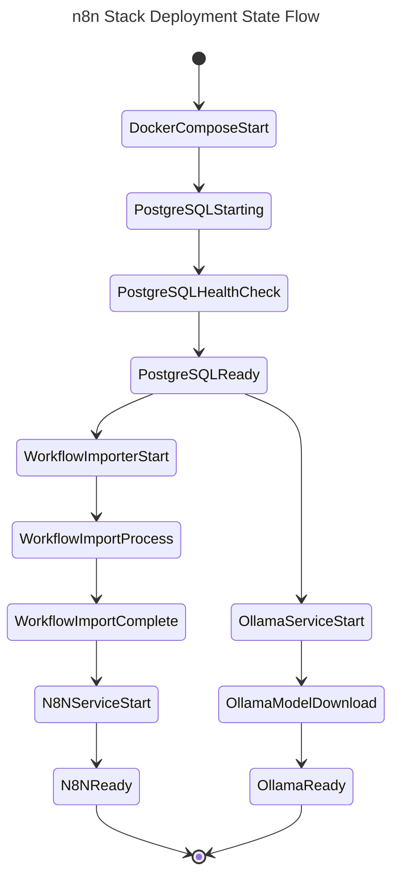

**Sequence Diagram: Interactions between systems to enable Feature**

This flowchart shows the interaction between Docker Compose services during deployment.

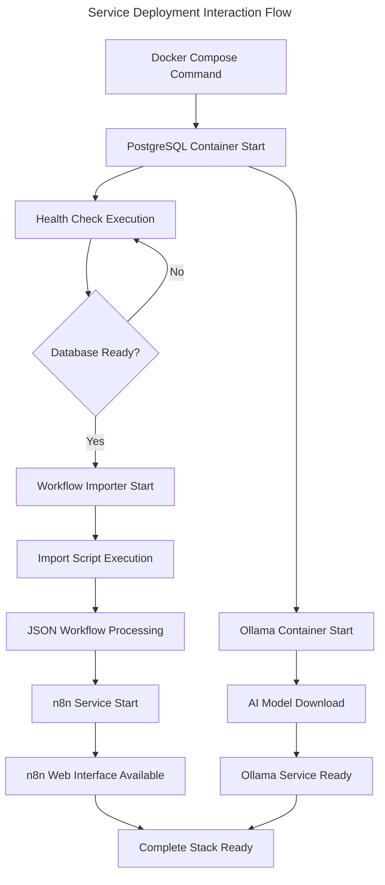

**Data Entity Relationship: Data structure for entities in Feature**

This diagram shows the data relationships between n8n components and storage systems.

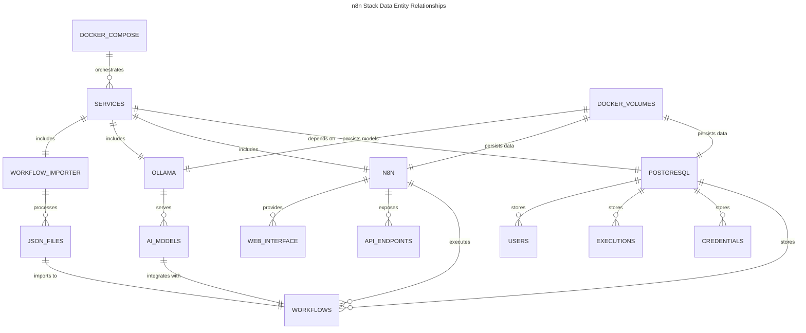

## USE-CASE: Automatic Workflow Import and Management

**Feature 1: JSON Workflow Import Automation**

|| definition |
|--|--|
| GIVEN | JSON workflow files are placed in the src/workflows directory |
| WHEN | The Docker stack is started or restarted |
| THEN | All workflow files are automatically imported into n8n with duplicate detection |

**State Diagram: Logic flow within feature**

This diagram shows the workflow import process with duplicate detection logic.

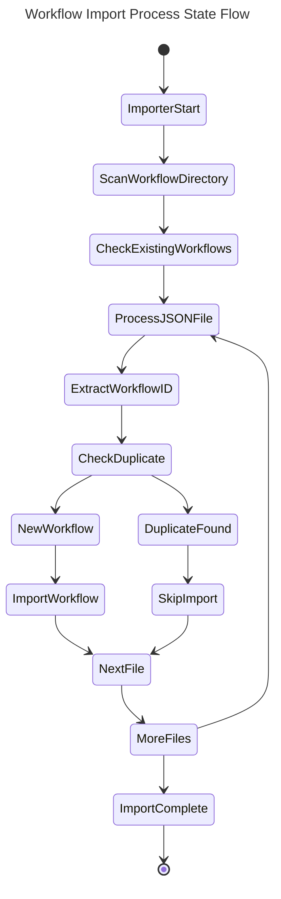

## USE-CASE: AI-Powered Workflow Automation

**Feature 1: Ollama AI Integration for Workflows**

|| definition |
|--|--|
| GIVEN | The Ollama service is running with llama3.2:3b model |
| WHEN | An n8n workflow includes AI processing nodes |
| THEN | The workflow can leverage local AI capabilities for text processing and generation |

**State Diagram: Logic flow within feature**

This diagram shows the AI integration workflow execution process.

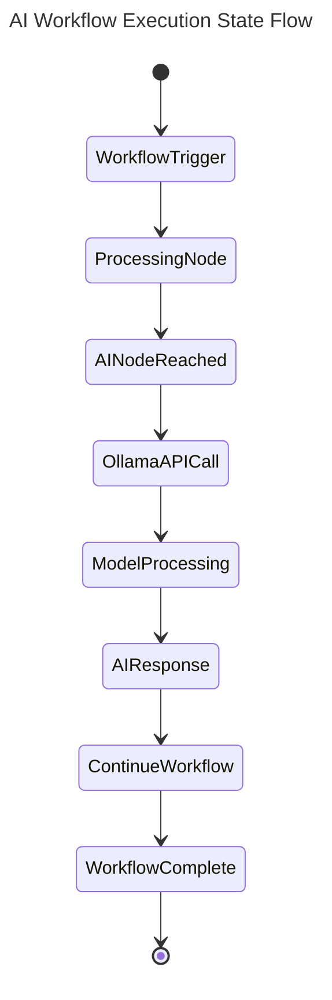

## USE-CASE: GitHub Repository Workflow Synchronization

**Feature 1: Bidirectional GitHub Workflow Sync**

|| definition |
|--|--|
| GIVEN | A GitHub repository contains n8n workflow JSON files and GitHub PAT is configured |
| WHEN | The github_repo_workflows_sync workflow is triggered (weekly or manually) |
| THEN | Workflows are synchronized bidirectionally between n8n instance and GitHub repository |

**State Diagram: Logic flow within feature**

This diagram shows the GitHub synchronization process with conflict resolution.

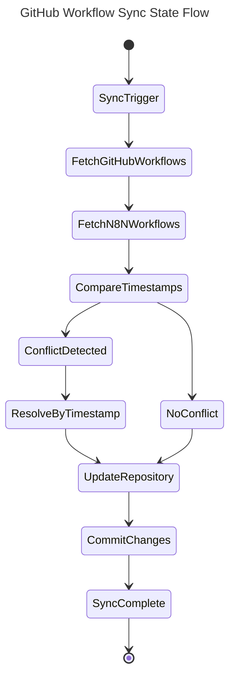

## USE-CASE: Project Tree Generation and Management

**Feature 1: Automated Project Tree Creation**

|| definition |
|--|--|
| GIVEN | A project directory structure exists with various files and folders |
| WHEN | The gtree_creator workflow is executed with project path input |
| THEN | A comprehensive project tree structure is generated and stored for documentation purposes |

**State Diagram: Logic flow within feature**

This diagram shows the project tree generation workflow process.

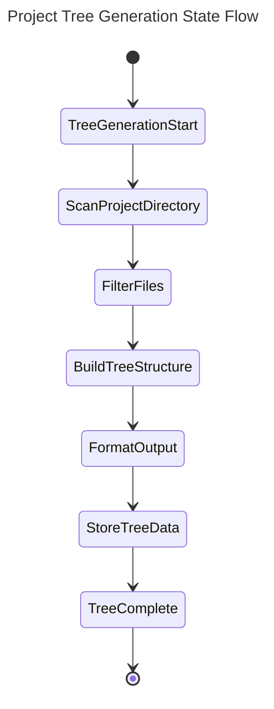

## USE-CASE: File Archive Management

**Feature 1: Automated ZIP Archive Creation and Distribution**

|| definition |
|--|--|
| GIVEN | Files need to be archived and distributed from the local file system |
| WHEN | The zip_make and zip_send workflows are triggered with file specifications |
| THEN | Files are compressed into ZIP archives and distributed to specified destinations |

**State Diagram: Logic flow within feature**

This diagram shows the file archiving and distribution process.

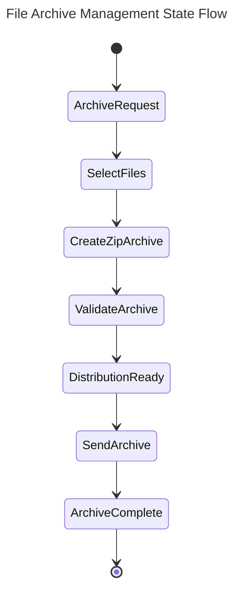

## USE-CASE: Workflow Cleanup and Maintenance

**Feature 1: Archived Workflow Deletion**

|| definition |
|--|--|
| GIVEN | n8n instance contains archived or obsolete workflows |
| WHEN | The delete_archived_workflows workflow is executed |
| THEN | Archived workflows are identified and safely removed from the n8n instance |

**State Diagram: Logic flow within feature**

This diagram shows the workflow cleanup process with safety checks.

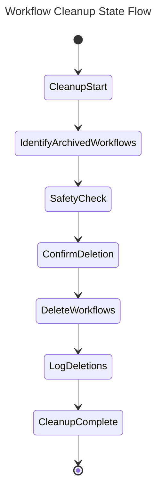

## USE-CASE: External Service Integration and Testing

**Feature 1: FastAPI Server Integration for Workflow Testing**

|| definition |
|--|--|
| GIVEN | A FastAPI server is available in the localfiles/someserver directory with sample endpoints |
| WHEN | n8n workflows need to test HTTP requests or integrate with external APIs |
| THEN | The FastAPI server provides test endpoints (/ and /items/{item_id}) for development and validation of HTTP-based workflow nodes |

**State Diagram: Logic flow within feature**

This diagram shows the external service integration process for workflow testing with the actual FastAPI endpoints.

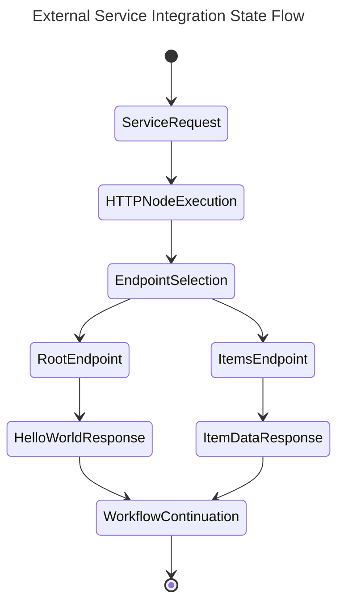

**Sequence Diagram: Interactions between systems to enable Feature**

This flowchart shows the interaction between n8n workflows and the FastAPI server for testing HTTP operations.

```mermaid
---
title: FastAPI Integration Sequence Flow
---
flowchart TD
    A["n8n HTTP Request Node"] --> B["FastAPI Server :8010"]
    B --> C{"Endpoint Selection"}
    C -->|GET /| D["Root Endpoint Handler"]
    C -->|GET /items/{id}| E["Items Endpoint Handler"]
    D --> F["Return Hello World JSON"]
    E --> G["Return Item Data JSON"]
    F --> H["n8n Response Processing"]
    G --> H
    H --> I["Continue Workflow Execution"]
```

**Data Entity Relationship: Data structure for entities in Feature**

This diagram shows the data relationships for the FastAPI server integration.

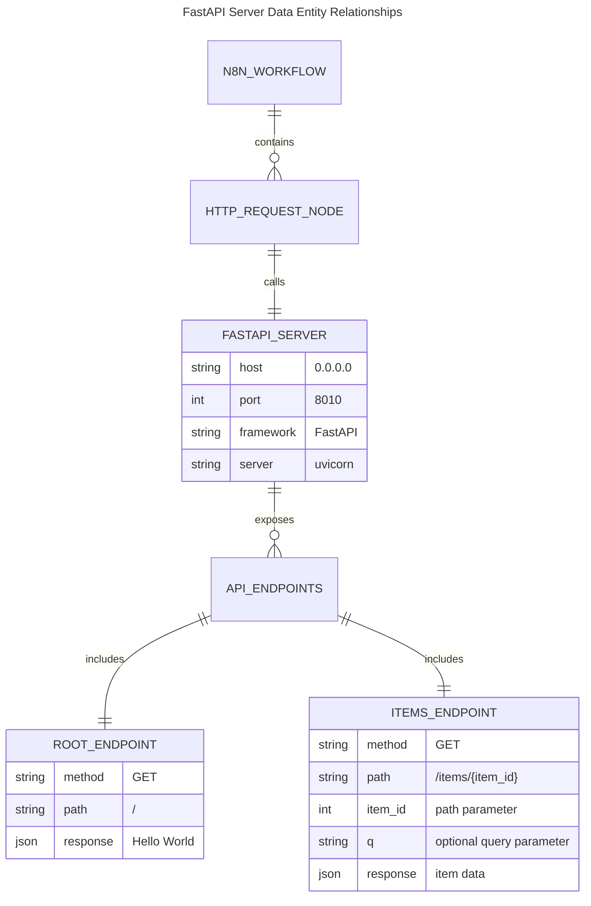

## USE-CASE: Comprehensive Workflow Collection Management

**Feature 1: Pre-configured Workflow Ecosystem**

|| definition |
|--|--|
| GIVEN | The system contains 9 pre-configured workflows covering GitHub sync, project analysis, file management, and cleanup operations |
| WHEN | The Docker stack is deployed and workflows are automatically imported |
| THEN | A complete automation ecosystem is available including GitHub synchronization, project tree generation, file archiving, and workflow maintenance |

**State Diagram: Logic flow within feature**

This diagram shows the comprehensive workflow ecosystem initialization and operation.

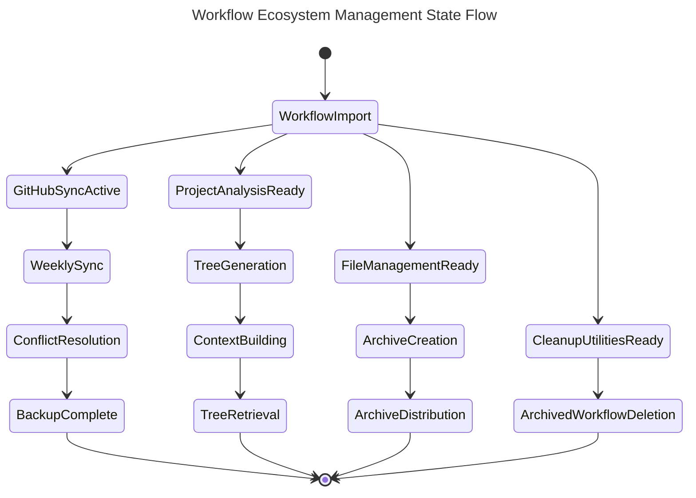

**Sequence Diagram: Interactions between systems to enable Feature**

This flowchart shows how the different workflow categories interact within the ecosystem.

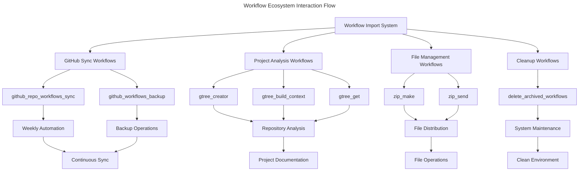

**Data Entity Relationship: Data structure for entities in Feature**

This diagram shows the relationships between different workflow categories and their data dependencies.

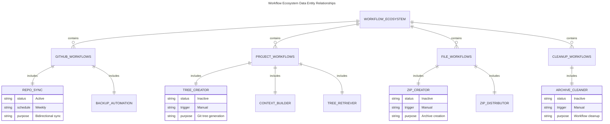

## USE-CASE: Comprehensive Monitoring and Observability

**Feature 1: Complete Stack Monitoring with Prometheus, Grafana, and AlertManager**

|| definition |
|--|--|
| GIVEN | The n8n Docker stack is running with monitoring services deployed |
| WHEN | Users access Grafana dashboards and Prometheus metrics |
| THEN | Complete observability is provided for all services including n8n, PostgreSQL, Ollama, and system resources |

**State Diagram: Logic flow within feature**

This diagram shows the monitoring stack initialization and data collection process.

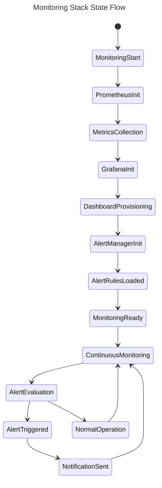

**Sequence Diagram: Interactions between systems to enable Feature**

This flowchart shows the interaction between monitoring components and monitored services.

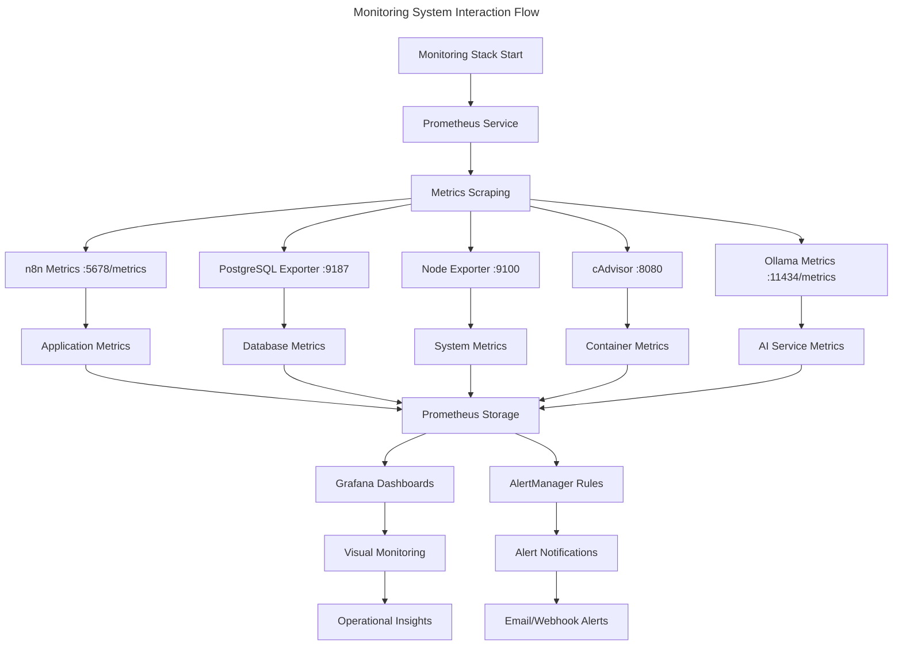

## USE-CASE: Real-time Performance Monitoring and Alerting

**Feature 1: Automated Alert System with Multi-channel Notifications**

|| definition |
|--|--|
| GIVEN | Monitoring stack is configured with alert rules for service health, resource usage, and database performance |
| WHEN | System metrics exceed defined thresholds or services become unavailable |
| THEN | Alerts are automatically triggered and routed to appropriate notification channels (email, webhooks, n8n workflows) |

**State Diagram: Logic flow within feature**

This diagram shows the alert processing and notification workflow.

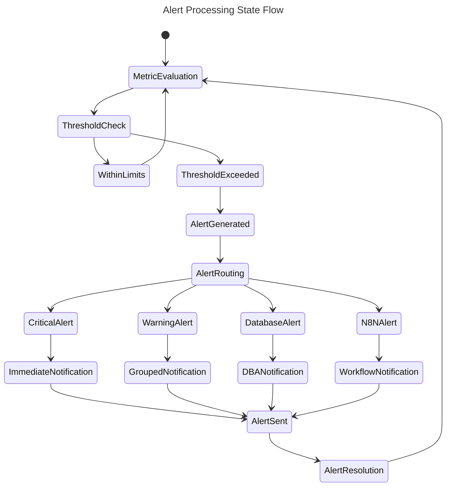

## USE-CASE: Historical Data Analysis and Capacity Planning

**Feature 1: Long-term Metrics Storage and Trend Analysis**

|| definition |
|--|--|
| GIVEN | Prometheus is configured with 30-day data retention and Grafana dashboards show historical trends |
| WHEN | Administrators need to analyze system performance over time or plan for capacity changes |
| THEN | Historical metrics data is available for trend analysis, capacity planning, and performance optimization |

**Data Entity Relationship: Data structure for entities in Feature**

This diagram shows the relationships between monitoring components and their data storage.

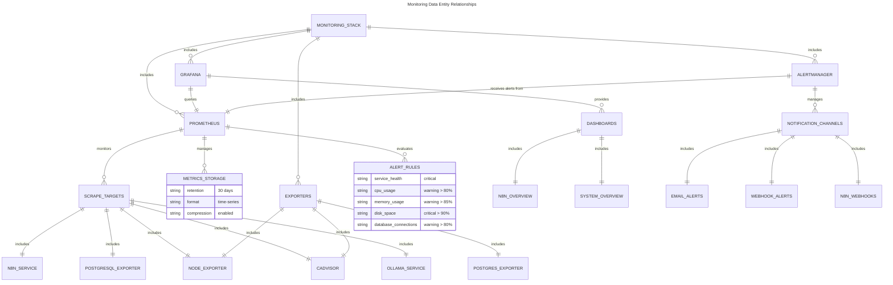
